# System Design Master Guide

> A complete, enterprise-grade reference covering core system design concepts — written to be accessible to beginners while remaining technically precise for architects and engineers.

---

## Table of Contents

1. [Client-Server Architecture](#1-client-server-architecture)
2. [IP Address](#2-ip-address)
3. [Domain Name System (DNS)](#3-domain-name-system-dns)
4. [Proxy](#4-proxy)
5. [Reverse Proxy](#5-reverse-proxy)
6. [Latency](#6-latency)
7. [HTTP and HTTPS](#7-http-and-https)
8. [APIs (Application Programming Interfaces)](#8-apis-application-programming-interfaces)
9. [REST API vs GraphQL](#9-rest-api-vs-graphql)
10. [Database](#10-database)
11. [SQL vs NoSQL](#11-sql-vs-nosql)
12. [Vertical vs Horizontal Scaling](#12-vertical-vs-horizontal-scaling)
13. [Load Balancer](#13-load-balancer)
14. [Database Indexing](#14-database-indexing)
15. [Replication](#15-replication)
16. [Sharding](#16-sharding)
17. [Vertical Partitioning](#17-vertical-partitioning)
18. [Caching (All Patterns)](#18-caching-all-patterns)
19. [CAP Theorem](#19-cap-theorem)
20. [Blob Storage](#20-blob-storage)
21. [Content Delivery Network (CDN)](#21-content-delivery-network-cdn)
22. [WebSockets](#22-websockets)
23. [Webhooks](#23-webhooks)
24. [Microservices vs Monolithic Architecture](#24-microservices-vs-monolithic-architecture)
25. [Message Queues](#25-message-queues)
26. [Rate Limiting](#26-rate-limiting)
27. [API Gateway](#27-api-gateway)
28. [Idempotency](#28-idempotency)
29. [Denormalization](#29-denormalization)

---

## 1. Client-Server Architecture

### 1. Simple Definition

Client-Server Architecture is a computing model where two types of programs communicate over a network:

- **Client** — the program that sends requests (e.g., a web browser, mobile app).
- **Server** — the program that receives requests, processes them, and returns a response (e.g., a web server, API server).

Think of it like a restaurant: you (the client) place an order; the kitchen (the server) prepares and delivers your food.

### 2. Why It Is Used

- Centralizes data and business logic on the server for consistency.
- Allows many clients to share the same server resources.
- Simplifies client devices — they do not need to store data or run complex logic.
- Enables independent updates to clients and servers.

### 3. How It Works (Step-by-Step)

1. The user opens a browser or app (the client).
2. The client sends an HTTP request to the server's address.
3. The server receives the request and processes it (reads a database, runs logic, etc.).
4. The server sends an HTTP response back to the client.
5. The client renders or uses the response data.

### 4. Visual Diagram

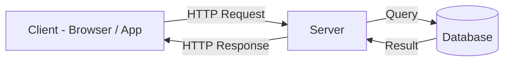

### 5. Architecture Flow

1. **Client → Server**: Client sends a request with a URL, HTTP method, headers, and optional body.
2. **Server → Business Logic**: Server parses the request and runs application logic.
3. **Server → Database**: Server queries or writes to the database.
4. **Database → Server**: Database returns the result.
5. **Server → Client**: Server packages the result into a response and returns it.

### 6. Real-World Example

- **Daily life**: Searching on Google — your browser (client) sends a query to Google's servers, and the server returns search results.
- **Company example**: Netflix — the Netflix app (client) requests a video stream; Netflix's servers authenticate the user and stream the video.

### 7. Tools / Technologies Used

- **Client**: Browsers, iOS/Android apps, CLI tools, Postman.
- **Server**: Node.js, Django, Spring Boot, Rails, ASP.NET.
- **Communication**: HTTP, HTTPS, gRPC, WebSockets.
- **Infrastructure**: AWS EC2, Google Cloud, Azure VMs.

### 8. Advantages

- Simple and well-understood model.
- Centralized control makes updates and security easier.
- Scales server independently from clients.
- Clear separation of responsibilities.

### 9. Disadvantages

- Server can become a bottleneck under high load.
- Single point of failure if the server goes down.
- Network latency adds delay compared to local processing.

### 10. Comparison Table

| Aspect | Client | Server |
|---|---|---|
| Role | Sends requests | Processes requests |
| Location | User device | Data center / cloud |
| Resource intensity | Low | High |
| Examples | Browser, mobile app | Web server, API server |

### 11. Company Workflow Example

**Amazon.com product page request:**

1. User clicks a product link in the Amazon app (client).
2. App sends an HTTPS GET request to Amazon's API gateway.
3. API gateway routes the request to the Product Service.
4. Product Service queries the product database (DynamoDB / Aurora).
5. Database returns product data (name, price, images, reviews).
6. Product Service assembles the response payload.
7. Response is returned to the app through the API gateway.
8. App renders the product page for the user.

---

## 2. IP Address

### 1. Simple Definition

An **IP Address** (Internet Protocol Address) is a unique numerical label assigned to every device connected to a network. It is used to identify and locate devices so they can communicate with each other.

Think of it like a home address: just as a postal carrier needs your address to deliver a letter, the internet needs an IP address to deliver data to the right device.

### 2. Why It Is Used

- Uniquely identifies each device on a network.
- Enables routers to forward data packets to the correct destination.
- Allows servers to know which client to send a response to.
- Supports network security policies (allow/block by IP).

### 3. How It Works (Step-by-Step)

1. Every device joining a network is assigned an IP address (static or dynamic via DHCP).
2. When data is sent, it is broken into small packets.
3. Each packet is labeled with the source IP and the destination IP.
4. Routers read the destination IP and forward each packet toward the destination.
5. Packets arrive at the destination device, which reassembles them.

### 4. Visual Diagram

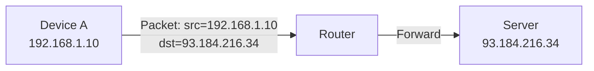

### 5. Architecture Flow

1. **DNS resolution**: Domain name (e.g., `google.com`) is resolved to an IP address.
2. **Source labeling**: Your device stamps its own IP as the source on every packet.
3. **Routing**: Packets travel through multiple routers, each reading the destination IP.
4. **Delivery**: The final router delivers packets to the destination server.
5. **Reply**: The server uses your source IP to send the response back.

### 6. Real-World Example

- **Daily life**: Your home router gets a public IP from your ISP. Your phone gets a private IP (e.g., `192.168.1.5`) from your router.
- **Company example**: Google's servers have well-known public IPs. When you visit `google.com`, your request is ultimately routed to one of those IPs.

### 7. Tools / Technologies Used

- **DHCP Server**: Assigns IP addresses dynamically (ISC DHCP, Windows DHCP).
- **DNS**: Translates names to IPs (BIND, AWS Route 53).
- **Routing Protocols**: BGP, OSPF.
- **Diagnostic tools**: `ping`, `traceroute`, `nslookup`, `ipconfig`/`ifconfig`.

### 8. Advantages

- Globally standardized — enables universal communication.
- Supports both private and public addressing.
- IPv6 provides virtually unlimited address space.
- Enables precise traffic routing and security policies.

### 9. Disadvantages

- IPv4 has a limited address space (~4.3 billion addresses).
- IP addresses alone do not guarantee security.
- Dynamic IP addresses can change, complicating direct addressing.
- IPv4 to IPv6 transition adds operational complexity.

### 10. Comparison Table

| Feature | IPv4 | IPv6 |
|---|---|---|
| Address length | 32-bit | 128-bit |
| Example | `192.168.1.1` | `2001:0db8::1` |
| Total addresses | ~4.3 billion | ~340 undecillion |
| NAT required? | Often yes | Not required |
| Adoption | Universal | Growing |

### 11. Company Workflow Example

**AWS EC2 instance receiving a web request:**

1. User opens browser and types `example.com`.
2. DNS resolver returns the server's public IP (e.g., `54.230.10.5`).
3. Browser creates a TCP packet with source = user's IP, destination = `54.230.10.5`.
4. Packet traverses ISP routers, then AWS edge routers.
5. AWS routes the packet to the EC2 instance inside a VPC.
6. EC2 instance processes the request and responds to the user's IP.
7. Response travels back through routers to the user's device.

---

## 3. Domain Name System (DNS)

### 1. Simple Definition

The **Domain Name System (DNS)** is a directory service for the internet. It converts human-readable domain names (like `www.google.com`) into machine-readable IP addresses (like `142.250.80.46`) so that computers can find each other.

Think of it as the internet's phonebook: you look up a name and get the corresponding number.

### 2. Why It Is Used

- Humans remember names, not numbers — DNS bridges the gap.
- Allows servers to change IP addresses without breaking URLs.
- Enables load balancing and geographic routing at the DNS level.
- Supports email routing (MX records) and service discovery (SRV records).

### 3. How It Works (Step-by-Step)

1. You type `www.example.com` in your browser.
2. Your OS checks its local DNS cache — if found, returns immediately.
3. If not cached, the OS queries a **Recursive Resolver** (usually provided by your ISP or a public resolver like `8.8.8.8`).
4. The Recursive Resolver queries the **Root Name Server** to find who manages `.com` domains.
5. The Root Server directs the resolver to the **TLD Name Server** for `.com`.
6. The TLD Server directs the resolver to the **Authoritative Name Server** for `example.com`.
7. The Authoritative Name Server returns the IP address.
8. The resolver caches the result (based on TTL) and returns it to your browser.
9. Your browser connects to the IP address.

### 4. Visual Diagram

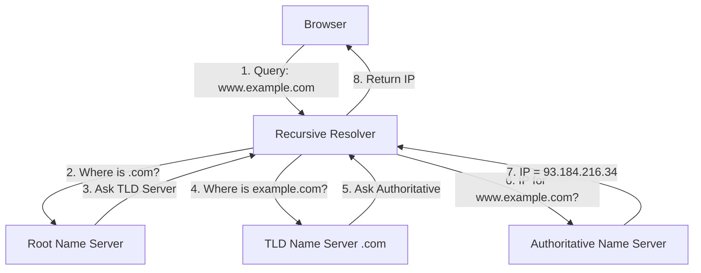

### 5. Architecture Flow

1. Browser checks local cache → OS cache → router cache.
2. Cache miss triggers a query to the recursive resolver.
3. Resolver walks the DNS hierarchy: Root → TLD → Authoritative.
4. Authoritative server returns the record (A, AAAA, CNAME, etc.).
5. Resolver caches the response using the TTL value.
6. Resolver returns the IP to the client.
7. Client establishes a TCP/TLS connection to the resolved IP.

### 6. Real-World Example

- **Daily life**: Visiting `amazon.com` — your browser quietly runs a DNS lookup before loading the page.
- **Company example**: Netflix uses Geo-DNS to route users to the nearest CDN edge server based on their location.

### 7. Tools / Technologies Used

- **Public Resolvers**: Google (`8.8.8.8`), Cloudflare (`1.1.1.1`).
- **DNS Hosting**: AWS Route 53, Cloudflare DNS, NS1.
- **Server Software**: BIND, PowerDNS, CoreDNS.
- **Diagnostic tools**: `dig`, `nslookup`, `host`.

### 8. Advantages

- Abstracts IP addresses behind memorable names.
- Enables zero-downtime IP changes via DNS updates.
- Supports traffic routing, failover, and geo-steering.
- Globally distributed — highly resilient.

### 9. Disadvantages

- Propagation delays due to TTL caching.
- DNS can be an attack vector (DNS spoofing, DDoS on resolvers).
- Misconfiguration can take services offline.

### 10. Comparison Table

| DNS Record Type | Purpose | Example |
|---|---|---|
| A | Maps domain to IPv4 | `example.com → 93.184.216.34` |
| AAAA | Maps domain to IPv6 | `example.com → 2606:2800::1` |
| CNAME | Alias to another domain | `www → example.com` |
| MX | Mail server for domain | `mail.example.com` |
| TXT | Arbitrary text (SPF, DKIM) | `v=spf1 include:...` |
| SRV | Service discovery | `_http._tcp.example.com` |

### 11. Company Workflow Example

**Cloudflare handling DNS for a global SaaS product:**

1. SaaS product registers `app.saas.com` with Cloudflare DNS.
2. Cloudflare creates Anycast IP addresses served from 300+ data centers.
3. User in Tokyo queries `app.saas.com`.
4. Tokyo's ISP resolver queries Cloudflare's Anycast network.
5. The nearest Cloudflare node responds with the IP of the closest application server.
6. User's browser connects to the Tokyo application server — sub-10ms DNS resolution.
7. Cloudflare's health checks automatically update DNS if the Tokyo server fails.

---

## 4. Proxy

### 1. Simple Definition

A **Proxy** (also called a **Forward Proxy**) is a server that sits between a client and the internet. When the client wants to access a website, the request goes to the proxy first. The proxy then makes the request on behalf of the client and returns the response.

Think of it like a secretary: instead of calling someone directly, you tell your secretary, who makes the call for you.

### 2. Why It Is Used

- **Anonymity**: Hides the client's real IP address from external servers.
- **Content filtering**: Organizations block access to certain websites.
- **Caching**: Stores frequently requested content to reduce bandwidth.
- **Security**: Inspects and filters outgoing traffic for malware or policy violations.
- **Access control**: Restricts which external sites employees can visit.

### 3. How It Works (Step-by-Step)

1. Client sends a request to the proxy server instead of directly to the internet.
2. The proxy evaluates the request against access policies.
3. If allowed, the proxy forwards the request to the target server using the proxy's own IP.
4. The target server responds to the proxy (not the client).
5. The proxy optionally caches the response.
6. The proxy forwards the response back to the client.

### 4. Visual Diagram

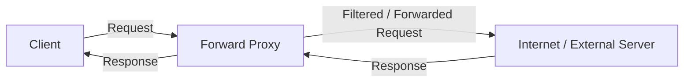

### 5. Architecture Flow

1. **Client → Proxy**: Client is configured to route all traffic through the proxy.
2. **Proxy → Policy Check**: Proxy checks URL against allowlist/blocklist.
3. **Proxy → External Server**: Proxy sends the request using its own IP.
4. **External Server → Proxy**: Response returns to proxy.
5. **Proxy → Cache Store**: Response optionally cached for future requests.
6. **Proxy → Client**: Response delivered to the original client.

### 6. Real-World Example

- **Daily life**: A school network uses a proxy to prevent students from accessing social media during school hours.
- **Company example**: Large enterprises use proxies (like Zscaler or Squid) to inspect all employee internet traffic for data leakage and malware.

### 7. Tools / Technologies Used

- **Squid Proxy**: Open-source HTTP proxy and cache.
- **Zscaler**: Enterprise cloud proxy.
- **Burp Suite**: Proxy for security testing.
- **Charles Proxy**: Developer debugging proxy.
- **mitmproxy**: Open-source HTTPS proxy for testing.

### 8. Advantages

- Provides anonymity for clients.
- Enables organization-wide content filtering.
- Reduces bandwidth via response caching.
- Centralizes and logs all outbound internet activity.

### 9. Disadvantages

- Adds a network hop — slightly increases latency.
- Single point of failure if the proxy goes down.
- Cannot inspect encrypted HTTPS traffic without SSL interception.
- Requires client-side configuration.

### 10. Comparison Table

| Feature | Forward Proxy | Reverse Proxy |
|---|---|---|
| Sits between | Client and internet | Internet and servers |
| Protects | Client identity | Server identity |
| Used by | Users / organizations | Website owners |
| Example | Squid, Zscaler | Nginx, Cloudflare |

### 11. Company Workflow Example

**Enterprise using Zscaler Forward Proxy:**

1. Employee's laptop is configured to route all web traffic through Zscaler.
2. Employee opens a browser and requests `socialnetwork.com`.
3. Request hits the Zscaler proxy.
4. Zscaler checks the URL against the company policy — `socialnetwork.com` is blocked.
5. Employee receives a "blocked by policy" page.
6. Employee requests `github.com` — allowed.
7. Zscaler forwards the request, scanning for malware in the response.
8. Clean response is delivered to the employee's browser.
9. All requests are logged for compliance auditing.

---

## 5. Reverse Proxy

### 1. Simple Definition

A **Reverse Proxy** is a server that sits in front of one or more backend servers. When a client sends a request, it first reaches the reverse proxy. The proxy then decides which backend server should handle it, forwards the request, and returns the response — all invisible to the client.

Think of it like a hotel front desk: guests talk to the receptionist, who routes them to the right staff member behind the scenes.

### 2. Why It Is Used

- **Load distribution**: Spreads traffic across multiple servers.
- **TLS termination**: Handles SSL/HTTPS encryption at a single point.
- **Security**: Hides backend server IPs from the public internet.
- **Caching**: Caches static content at the proxy layer.
- **Compression**: Compresses responses before delivering to clients.
- **Rate limiting and WAF**: Blocks malicious traffic before it hits applications.

### 3. How It Works (Step-by-Step)

1. Client sends an HTTPS request to `api.example.com`.
2. Request reaches the reverse proxy (e.g., Nginx).
3. Reverse proxy terminates the TLS connection.
4. Proxy applies routing rules based on the URL path or headers.
5. Proxy forwards the decrypted request to the appropriate backend server.
6. Backend processes the request and responds to the proxy.
7. Proxy optionally compresses or caches the response.
8. Proxy returns the response to the client over a new TLS connection.

### 4. Visual Diagram

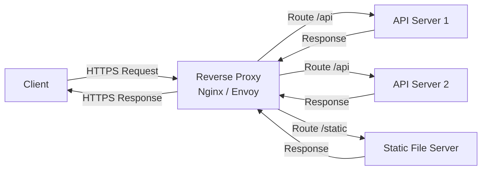

### 5. Architecture Flow

1. DNS resolves `api.example.com` to the reverse proxy's public IP.
2. Client establishes TLS with the reverse proxy.
3. Reverse proxy reads the request URL, host header, or path.
4. Proxy applies load balancing or routing rules.
5. Proxy opens a connection to the chosen backend server (usually HTTP internally).
6. Backend processes the request.
7. Proxy receives the backend response.
8. Proxy returns the response to the client.

### 6. Real-World Example

- **Daily life**: When you visit a news website, a reverse proxy routes your request to one of hundreds of servers without you knowing.
- **Company example**: Cloudflare acts as a reverse proxy for millions of websites — handling TLS, DDoS protection, caching, and load balancing before requests reach origin servers.

### 7. Tools / Technologies Used

- **Nginx**: Most popular open-source reverse proxy.
- **Envoy**: High-performance proxy used in service meshes (Istio).
- **HAProxy**: Reliable, high-performance TCP/HTTP reverse proxy.
- **Cloudflare**: Global reverse proxy / CDN / WAF.
- **AWS ALB**: AWS Application Load Balancer (Layer 7 reverse proxy).

### 8. Advantages

- Protects backend servers from direct exposure.
- Centralizes TLS termination, reducing backend complexity.
- Enables zero-downtime deployments via traffic shifting.
- Improves performance with caching and compression.

### 9. Disadvantages

- Becomes a critical failure point if not made highly available.
- Adds configuration and operational complexity.
- Can become a performance bottleneck under extreme traffic.

### 10. Comparison Table

| Feature | Forward Proxy | Reverse Proxy |
|---|---|---|
| Protects | Client | Backend servers |
| Client awareness | Client must configure it | Client is unaware |
| Common use | Privacy, content filtering | Load balancing, TLS, security |
| Examples | Squid, Zscaler | Nginx, HAProxy, Cloudflare |

### 11. Company Workflow Example

**Netflix using Envoy reverse proxy:**

1. User opens Netflix on a Smart TV.
2. App sends HTTPS request to `api.netflix.com`.
3. Request arrives at Envoy reverse proxy in Netflix's edge infrastructure.
4. Envoy terminates TLS, inspects the request, and applies authentication.
5. Envoy routes the request to the appropriate microservice (e.g., Title Service).
6. Title Service fetches data and returns a response to Envoy.
7. Envoy logs the transaction for observability.
8. Envoy returns the response to the TV app.
9. Envoy's health checks automatically remove unhealthy Title Service instances from the pool.

---

## 6. Latency

### 1. Simple Definition

**Latency** is the time it takes for a single request to travel from the sender to the destination and for the response to return. It is measured in **milliseconds (ms)**.

Think of it like the delay between clicking a light switch and the light turning on — the smaller the delay, the better.

### 2. Why It Is Used

Latency is measured and optimized because:

- High latency degrades user experience (slow page loads, laggy apps).
- Financial systems (trading, payments) require sub-millisecond latency.
- Real-time applications (gaming, video calls) are unusable at high latency.
- It is a key reliability and performance SLA metric.

### 3. How It Works (Step-by-Step)

Latency has several components:

1. **Transmission delay**: Time to push data onto the network link.
2. **Propagation delay**: Time for the signal to physically travel (distance / speed of light in fiber).
3. **Queuing delay**: Time spent waiting in router queues.
4. **Processing delay**: Time for routers and servers to process the packet.

The round-trip total is called **RTT (Round-Trip Time)**.

### 4. Visual Diagram

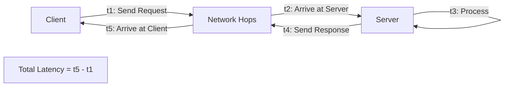

### 5. Architecture Flow

1. **Client action**: User triggers a request (button click, page load).
2. **DNS lookup**: Domain name resolved to IP (adds latency if not cached).
3. **TCP handshake**: 1–2 round trips before data is sent (reduced with HTTP/2, eliminated with HTTP/3).
4. **TLS handshake**: Additional round trip for HTTPS.
5. **Data transmission**: Request travels through ISP, internet backbone, and data center networks.
6. **Server processing**: Application logic, database queries, external service calls.
7. **Response transmission**: Response travels back to the client.

### 6. Real-World Example

- **Daily life**: Typing in Google Search — most results appear in under 200ms due to heavy latency optimization (edge servers, caching, pre-fetching).
- **Company example**: High-frequency trading firms co-locate servers next to stock exchange data centers to achieve single-digit microsecond latency.

### 7. Tools / Technologies Used

- **Measurement**: Ping, `traceroute`, Wireshark, New Relic, Datadog.
- **Reduction strategies**: CDNs (edge caching), connection pooling, HTTP/2, gRPC, In-memory caching (Redis).
- **Protocols**: HTTP/3 (QUIC) eliminates TCP handshake overhead.

### 8. Advantages (of low latency systems)

- Better user experience and higher conversion rates.
- Enables real-time use cases (gaming, trading, video calls).
- Improves system throughput under high concurrency.

### 9. Disadvantages (latency as a constraint)

- Physical distance cannot be fully overcome (speed of light limit).
- Optimizing for low latency can conflict with consistency guarantees.
- Aggressive caching (which reduces latency) can serve stale data.

### 10. Comparison Table

| Latency Range | User Perception | Typical Context |
|---|---|---|
| < 1 ms | Instantaneous | In-memory / local CPU operations |
| 1–10 ms | Very fast | Same data center |
| 10–100 ms | Fast | Same country / CDN edge |
| 100–300 ms | Noticeable | Cross-continent |
| > 300 ms | Slow / frustrating | Cross-ocean without optimization |

### 11. Company Workflow Example

**Amazon reducing checkout page latency:**

1. Product images are cached on CloudFront CDN nodes close to the user.
2. HTML and CSS are served from the CDN edge, not the origin server.
3. API calls to the cart service use HTTP/2 multiplexing to eliminate sequential request delays.
4. Frequently accessed product data is cached in ElastiCache (Redis) to avoid database reads.
5. Database queries use indexes, reducing query time from seconds to milliseconds.
6. Servers are deployed in multiple AWS regions; users are routed to the closest one.
7. Result: checkout page loads in under 200ms globally.

---

## 7. HTTP and HTTPS

### 1. Simple Definition

- **HTTP (HyperText Transfer Protocol)**: A protocol that defines how data is sent and received between a client (browser) and a server. Data is sent in **plain text** — visible to anyone who intercepts the connection.
- **HTTPS (HTTP Secure)**: HTTP with an added layer of **TLS (Transport Layer Security)** encryption. Data is encrypted in transit, ensuring confidentiality and integrity.

Think of HTTP as sending a postcard (anyone can read it) and HTTPS as sending a sealed, tamper-proof letter.

### 2. Why It Is Used

- **HTTP**: Simpler, faster for non-sensitive content (internal networks, debugging).
- **HTTPS**: Mandatory for any application handling passwords, payments, or personal data. Also required by modern browsers (Chrome shows "Not Secure" for HTTP sites).

### 3. How It Works (Step-by-Step)

**HTTP:**
1. Client sends a request: `GET /page HTTP/1.1`.
2. Server responds: `HTTP/1.1 200 OK` with body.

**HTTPS:**
1. Client connects to server on port 443.
2. **TLS Handshake**:
   - Client sends "ClientHello" with supported cipher suites.
   - Server responds with its TLS certificate and chosen cipher.
   - Client verifies the certificate against trusted Certificate Authorities (CAs).
   - A symmetric session key is negotiated.
3. All subsequent data is encrypted with the session key.
4. Standard HTTP request/response occurs over the encrypted channel.

### 4. Visual Diagram

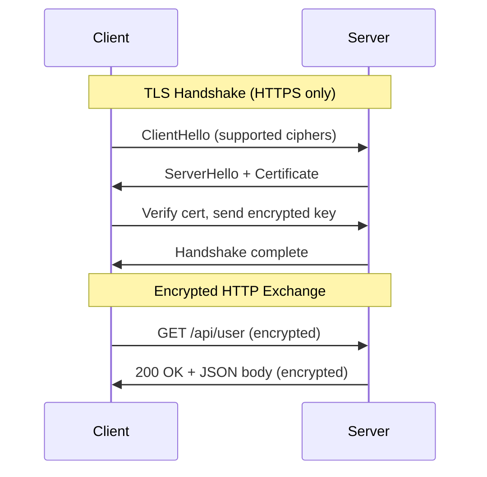

### 5. Architecture Flow

1. Client resolves the domain to an IP via DNS.
2. Client initiates a TCP connection to port 80 (HTTP) or port 443 (HTTPS).
3. For HTTPS: TLS handshake is performed (1–2 round trips).
4. Client sends an HTTP request (method, headers, optional body).
5. Server processes the request and returns an HTTP response (status code, headers, body).
6. Connection may be kept alive (HTTP Keep-Alive or HTTP/2 multiplexing) for multiple requests.

### 6. Real-World Example

- **Daily life**: Logging into your bank website — your password is protected by HTTPS encryption.
- **Company example**: Stripe enforces HTTPS on all API endpoints. Any HTTP request is automatically redirected to HTTPS, and HSTS ensures browsers never use HTTP again.

### 7. Tools / Technologies Used

- **TLS Certificates**: Let's Encrypt (free), DigiCert, AWS ACM.
- **Web servers**: Nginx, Apache, Caddy (auto-HTTPS).
- **Testing**: Curl, Postman, Wireshark.
- **Protocols**: HTTP/1.1, HTTP/2, HTTP/3 (QUIC).

### 8. Advantages

| | HTTP | HTTPS |
|---|---|---|
| Speed | Slightly faster (no TLS overhead) | Near-identical with modern hardware |
| Security | None — plain text | Encrypted, authenticated |
| SEO | Penalized by Google | Preferred by Google |

### 9. Disadvantages

- **HTTP**: No encryption — vulnerable to eavesdropping and man-in-the-middle attacks.
- **HTTPS**: Certificate management overhead; TLS adds minor latency (mitigated by TLS 1.3 and session resumption).

### 10. Comparison Table

| Feature | HTTP | HTTPS |
|---|---|---|
| Port | 80 | 443 |
| Encryption | None | TLS (AES, ChaCha20) |
| Authentication | None | Server identity verified via certificate |
| Data integrity | None | Guaranteed via MAC |
| SEO ranking | Lower | Higher |
| Required for | Internal tools | Any public-facing service |

### 11. Company Workflow Example

**GitHub enforcing HTTPS:**

1. GitHub registers a TLS certificate via DigiCert for `github.com`.
2. All HTTP requests to `github.com` receive a `301 Redirect` to `https://github.com`.
3. HSTS header is set: `Strict-Transport-Security: max-age=31536000` — browsers remember to always use HTTPS.
4. GitHub's CDN (Fastly) terminates TLS at the edge, reducing TLS handshake latency globally.
5. Traffic from Fastly to GitHub's origin servers uses internal HTTPS.
6. User's browser shows a green padlock — credentials and code are transmitted securely.

---
## 8. APIs (Application Programming Interfaces)

### 1. Simple Definition

An **API (Application Programming Interface)** is a contract that defines how two software systems communicate with each other. It specifies what requests can be made, what format they must follow, and what responses to expect.

Think of an API as a waiter in a restaurant: you (client) tell the waiter (API) what you want; the waiter relays it to the kitchen (backend system) and brings back your order.

### 2. Why It Is Used

- Allows different systems and teams to communicate without knowing each other's internal implementation.
- Enables third-party integrations (e.g., "Sign in with Google").
- Enables mobile apps, web apps, and IoT devices to share the same backend.
- Promotes modular architecture and faster development.

### 3. How It Works (Step-by-Step)

1. A developer reads the API documentation to understand available endpoints.
2. Client sends an HTTP request to an API endpoint (e.g., `POST /api/orders`).
3. The request includes headers (authentication, content type) and a body (JSON data).
4. The API server validates the request.
5. The API executes business logic and interacts with the database.
6. The API returns an HTTP response with a status code and JSON body.
7. Client parses the response and updates the UI.

### 4. Visual Diagram

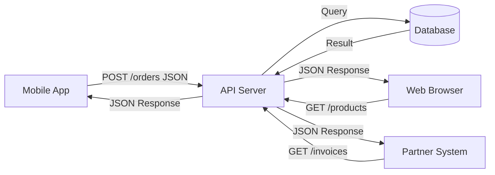

### 5. Architecture Flow

1. **Authentication**: Client includes an API key or JWT token in the request header.
2. **Rate limiting**: API gateway checks if the client has exceeded its quota.
3. **Routing**: Request is routed to the correct service/controller.
4. **Validation**: Input data is validated (type, format, required fields).
5. **Business logic**: The service processes the request.
6. **Data access**: Database or cache is queried.
7. **Response serialization**: Result is converted to JSON.
8. **Response delivery**: HTTP response sent with appropriate status code.

### 6. Real-World Example

- **Daily life**: When you press "Pay with PayPal" on a website, that website uses PayPal's API to process your payment.
- **Company example**: Twitter/X exposes an API allowing developers to post tweets, read timelines, and search content programmatically.

### 7. Tools / Technologies Used

- **Frameworks**: Express.js, FastAPI, Spring Boot, Django REST Framework.
- **Documentation**: Swagger / OpenAPI, Postman.
- **Testing**: Postman, Insomnia, k6.
- **Gateways**: AWS API Gateway, Kong, Apigee.
- **Authentication**: OAuth 2.0, API Keys, JWT.

### 8. Advantages

- Enables loose coupling between systems.
- Promotes reuse — one API serves many clients.
- Simplifies integrations with third parties.
- Enables independent versioning and deployment.

### 9. Disadvantages

- API changes can break dependent clients.
- Security vulnerabilities if authentication or input validation is weak.
- Network dependency — API unavailability can cascade to clients.
- Documentation must be kept current.

### 10. Comparison Table

| API Style | Protocol | Best For | Caching |
|---|---|---|---|
| REST | HTTP | Standard web/mobile | Yes (HTTP cache) |
| GraphQL | HTTP | Flexible data fetching | Harder |
| gRPC | HTTP/2 | Internal microservices | Limited |
| WebSocket | TCP | Real-time streaming | No |
| SOAP | HTTP/XML | Enterprise / legacy | Yes |

### 11. Company Workflow Example

**Stripe payment API integration:**

1. Merchant integrates Stripe API using the SDK.
2. User clicks "Pay" — merchant's frontend calls its own backend.
3. Merchant backend calls `POST https://api.stripe.com/v1/payment_intents` with amount and currency.
4. Request includes `Authorization: Bearer sk_live_...` header.
5. Stripe API validates the key, creates a payment intent, and returns a `client_secret`.
6. Merchant frontend uses the `client_secret` with Stripe.js to collect and tokenize card details.
7. Stripe confirms payment and sends a webhook event to the merchant.
8. Merchant backend receives `payment_intent.succeeded` and fulfills the order.

---

## 9. REST API vs GraphQL

### 1. Simple Definition

- **REST (Representational State Transfer)**: An architectural style where resources are exposed as URL endpoints. Each endpoint represents a specific resource or action (e.g., `/users`, `/orders/123`).
- **GraphQL**: A query language for APIs where the client specifies exactly what data it needs in a single request. The server exposes a single endpoint and a typed schema.

### 2. Why It Is Used

- **REST**: Universal adoption, simple, leverages HTTP semantics (GET/POST/PUT/DELETE), easy to cache.
- **GraphQL**: Eliminates over-fetching (getting too much data) and under-fetching (needing multiple requests). Ideal for complex, nested data requirements.

### 3. How It Works (Step-by-Step)

**REST:**
1. Client identifies the resource and action (e.g., `GET /users/42`).
2. Server returns the full user object regardless of what fields the client needs.
3. For related data (e.g., user's orders), client makes an additional `GET /users/42/orders` request.

**GraphQL:**
1. Client writes a query specifying only the needed fields:
   ```graphql
   query {
     user(id: 42) {
       name
       email
       orders { id total }
     }
   }
   ```
2. Client sends this to a single endpoint: `POST /graphql`.
3. Server returns only the requested fields including nested data in one response.

### 4. Visual Diagram

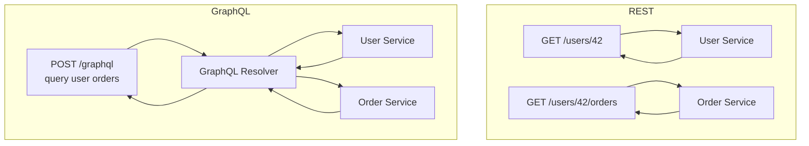

### 5. Architecture Flow

**REST:**
1. Multiple round trips for nested resources.
2. Server defines response shape — client adapts.
3. HTTP caching works naturally.

**GraphQL:**
1. Single round trip for nested data.
2. Client defines response shape — server adapts.
3. Requires query cost analysis to prevent expensive queries.
4. DataLoader pattern batches and deduplicates database calls.

### 6. Real-World Example

- **REST**: GitHub REST API (`api.github.com`) — standard, cached, well-documented.
- **GraphQL**: GitHub also exposes a GraphQL API (`api.github.com/graphql`), used by their own frontend to fetch exactly the fields needed for each UI component.
- **Company example**: Facebook invented GraphQL to address the challenge of mobile apps needing different data shapes than desktop apps — one schema, infinite client flexibility.

### 7. Tools / Technologies Used

| Category | REST | GraphQL |
|---|---|---|
| Server frameworks | Express, FastAPI, Spring | Apollo Server, Hasura, Strawberry |
| Client libraries | Axios, Fetch | Apollo Client, urql, URQL |
| Documentation | Swagger / OpenAPI | GraphQL Playground, GraphiQL |
| Testing | Postman, Insomnia | GraphiQL, Apollo Studio |

### 8. Advantages

| | REST | GraphQL |
|---|---|---|
| Learning curve | Low | Medium |
| Caching | Easy (HTTP cache) | Requires custom setup |
| Flexibility | Fixed response shape | Client-defined shape |
| Type safety | Optional (OpenAPI) | Built-in schema |
| Versioning | URL versioning (v1, v2) | Schema evolution (deprecation) |

### 9. Disadvantages

| | REST | GraphQL |
|---|---|---|
| Over-fetching | Common | Eliminated |
| Under-fetching | Common | Eliminated |
| Query complexity | N/A | Can be exploited |
| Caching | Simple | Complex |
| N+1 problem | Less common | Common without DataLoader |

### 10. Comparison Table

| Feature | REST | GraphQL |
|---|---|---|
| Endpoint count | Many | Single (`/graphql`) |
| Request type | Multiple requests for nested data | Single request |
| Response shape | Server-defined | Client-defined |
| HTTP caching | Native | Requires query hashing |
| Real-time support | Polling or WebSockets | Subscriptions built-in |
| Error handling | HTTP status codes | Always 200, errors in body |
| Schema | Optional (OpenAPI) | Mandatory |
| Best for | Public APIs, simple resources | Mobile apps, complex UIs |

### 11. Company Workflow Example

**Shopify's GraphQL Admin API:**

1. Shopify merchant installs a third-party inventory management app.
2. App queries Shopify's GraphQL API:
   ```graphql
   query {
     products(first: 50) {
       edges { node { id title variants { edges { node { sku inventoryQuantity } } } } }
     }
   }
   ```
3. Single request returns 50 products with variants and inventory — no over-fetching.
4. If the same app used REST, it would need: `GET /products` (50 products, full objects) + 50 × `GET /products/{id}/variants` = 51 requests.
5. GraphQL saves bandwidth and reduces mobile data consumption significantly.

---

## 10. Database

### 1. Simple Definition

A **database** is an organized system for storing, retrieving, and managing structured or unstructured data. It provides persistent storage (data survives server restarts), concurrent access control, and transaction management.

Think of a database as a highly organized filing cabinet with rules that ensure no two people can corrupt the same file simultaneously.

### 2. Why It Is Used

- Persists application data reliably (beyond server memory).
- Handles concurrent reads and writes without data corruption.
- Provides powerful query capabilities (search, filter, aggregate).
- Enforces data integrity through constraints and transactions.
- Supports backup, recovery, and replication for high availability.

### 3. How It Works (Step-by-Step)

1. Application sends a query (SQL or API call) to the database.
2. Database engine parses and optimizes the query.
3. Query executor accesses data from disk or memory (buffer pool).
4. **Transactions** ensure atomicity: all-or-nothing operations.
5. **Locking / MVCC** prevents concurrent conflicts.
6. Result is returned to the application.
7. Writes are committed to a **Write-Ahead Log (WAL)** for durability.

### 4. Visual Diagram

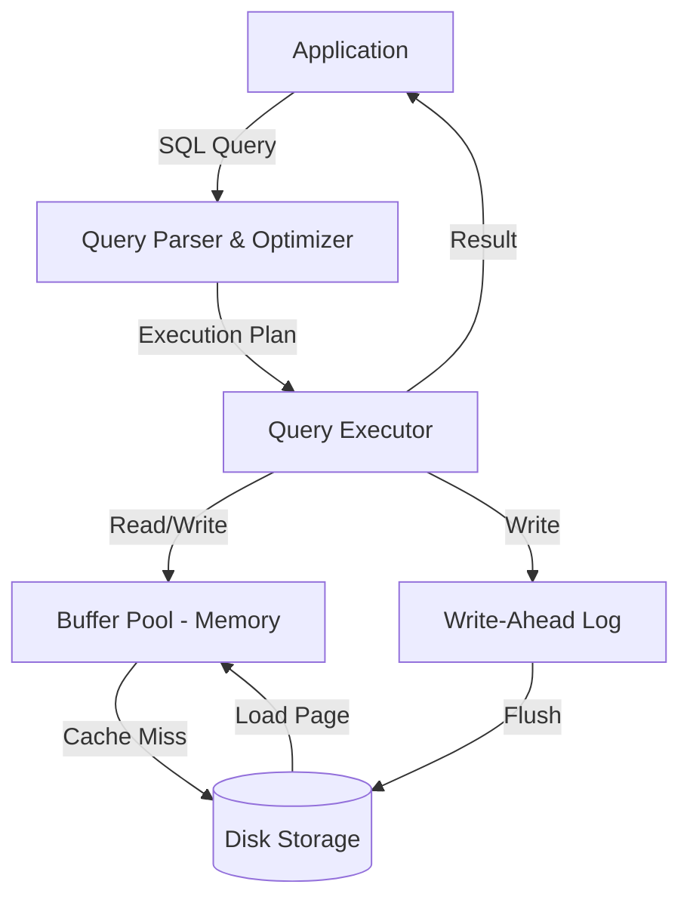

### 5. Architecture Flow

1. Application sends a query.
2. Query parser validates SQL syntax.
3. Query optimizer generates an efficient execution plan (using indexes, statistics).
4. Executor reads pages from the buffer pool (in-memory cache of disk pages).
5. On buffer miss, pages are loaded from disk.
6. Writes go to the WAL first (for crash recovery), then to the data files.
7. Transaction manager handles ACID properties.

### 6. Real-World Example

- **Daily life**: Your bank account balance is stored in a relational database. When you transfer money, a transaction ensures both the debit and credit happen atomically.
- **Company example**: Airbnb stores bookings, listings, and user data in a combination of MySQL (transactions), Elasticsearch (search), and Redis (caching).

### 7. Tools / Technologies Used

- **Relational (SQL)**: PostgreSQL, MySQL, Oracle, SQL Server.
- **NoSQL**: MongoDB, Cassandra, DynamoDB, Redis.
- **Search**: Elasticsearch, Solr.
- **Time-series**: InfluxDB, TimescaleDB.
- **Graph**: Neo4j.

### 8. Advantages

- ACID transactions ensure correctness.
- Powerful query language (SQL) supports complex data retrieval.
- Mature ecosystem with excellent tooling and support.

### 9. Disadvantages

- Scaling relational databases horizontally is complex.
- Schema changes can require migrations and downtime.
- High write throughput can strain single-node setups.

### 10. Comparison Table

| Database Type | Data Model | Strengths | Examples |
|---|---|---|---|
| Relational | Tables / rows | ACID, complex queries | PostgreSQL, MySQL |
| Document | JSON documents | Flexible schema | MongoDB, CouchDB |
| Key-Value | Key → Value | Ultra-fast lookups | Redis, DynamoDB |
| Wide-Column | Column families | High-write scale | Cassandra, HBase |
| Graph | Nodes + edges | Relationship queries | Neo4j |
| Time-series | Timestamped events | Metrics, monitoring | InfluxDB |

### 11. Company Workflow Example

**Instagram's data storage:**

1. User posts a photo — metadata (caption, location, timestamp) written to PostgreSQL.
2. Photo binary stored in object storage (AWS S3).
3. User's feed is computed and cached in Redis for fast retrieval.
4. Likes and comments are written to Cassandra for high-volume write throughput.
5. Full-text search of captions uses Elasticsearch.
6. Analytics aggregations run on a separate data warehouse (Apache Hive / Spark).

---

## 11. SQL vs NoSQL

### 1. Simple Definition

- **SQL (Structured Query Language) databases**: Use fixed schemas and tables with rows and columns. Support ACID transactions and complex joins. Also called **Relational Databases**.
- **NoSQL databases**: "Not Only SQL" — a broad category of databases using flexible data models (documents, key-value, wide-column, graph). Designed for scale, speed, and schema flexibility.

### 2. Why It Is Used

- **SQL**: When data has clear relationships, needs strong consistency, and requires complex queries.
- **NoSQL**: When data structures vary, write volumes are extremely high, or horizontal scaling is required.

### 3. How It Works (Step-by-Step)

**SQL:**
1. Define a schema (tables, columns, types, constraints).
2. Insert structured data that conforms to the schema.
3. Query using SQL with JOINs across related tables.
4. Database enforces referential integrity.

**NoSQL (Document example - MongoDB):**
1. Create a collection (equivalent to a table, but schema-free).
2. Insert documents (JSON objects, each can have different fields).
3. Query using document filters (no JOINs — embed related data).
4. Scale horizontally by adding nodes.

### 4. Visual Diagram

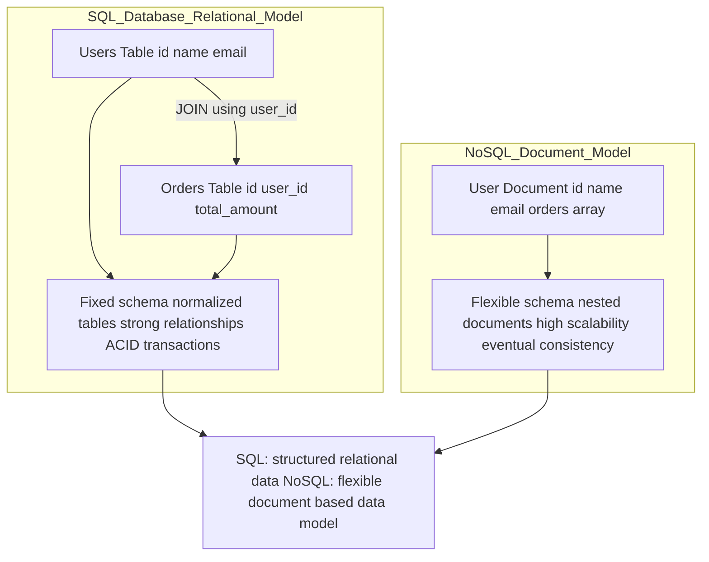

### 5. Architecture Flow

**SQL write path:**
1. Application sends `INSERT INTO orders (user_id, total) VALUES (42, 99.99)`.
2. Database validates foreign key (`user_id` must exist in users table).
3. Row is written with transaction log.
4. Commit confirms durability.

**NoSQL write path:**
1. Application sends a document insert: `{ userId: 42, total: 99.99 }`.
2. Document is routed to the correct shard/replica set.
3. Write is acknowledged (configurable consistency level).
4. Document is replicated asynchronously.

### 6. Real-World Example

- **SQL**: PayPal uses PostgreSQL for transaction records — ACID compliance is non-negotiable for financial data.
- **NoSQL**: MongoDB powers the content catalog for a media company where each article has different metadata fields.

### 7. Tools / Technologies Used

| Type | Tools |
|---|---|
| SQL | PostgreSQL, MySQL, MariaDB, SQL Server, Oracle |
| Document | MongoDB, CouchDB, Firestore |
| Key-Value | Redis, DynamoDB, Riak |
| Wide-Column | Apache Cassandra, HBase, Bigtable |
| Graph | Neo4j, Amazon Neptune |

### 8. Advantages

| | SQL | NoSQL |
|---|---|---|
| Data integrity | Strong (ACID) | Varies (BASE) |
| Query power | High (JOINs, aggregations) | Limited (varies by type) |
| Schema | Enforced | Flexible |
| Scaling | Vertical (primarily) | Horizontal |
| Consistency | Strong | Eventual (configurable) |

### 9. Disadvantages

| | SQL | NoSQL |
|---|---|---|
| Scaling | Complex horizontal scaling | Weaker relational queries |
| Schema changes | Migrations required | Risk of inconsistent data |
| JOINs | Supported | Not supported (embed instead) |
| Transactions | Full ACID | Limited (improving) |

### 10. Comparison Table

| Feature | SQL | NoSQL |
|---|---|---|
| Data model | Tables (rows/columns) | Document, Key-Value, Graph, Column |
| Schema | Fixed | Dynamic |
| Query language | SQL | Database-specific API |
| ACID support | Yes | Partial / varies |
| Horizontal scaling | Difficult | Native |
| Consistency | Strong | Eventually consistent (usually) |
| Best use cases | Finance, ERP, CRM | Catalogs, social, IoT, gaming |
| Examples | PostgreSQL, MySQL | MongoDB, Cassandra, Redis |

### 11. Company Workflow Example

**LinkedIn's hybrid database strategy:**

1. User profile data (structured, relational) → MySQL clusters.
2. Connection graph (who knows whom) → custom graph database (Voldemort / Espresso).
3. Activity feed (high write volume, time-ordered) → Apache Kafka + Cassandra.
4. Search (profile text search) → Elasticsearch.
5. Session data (fast key-value lookup) → Redis.
6. Analytics (batch processing) → Apache Spark on HDFS.

Each database type is chosen based on the specific access pattern and consistency requirements of that data domain.

---

## 12. Vertical vs Horizontal Scaling

### 1. Simple Definition

- **Vertical Scaling (Scale Up)**: Making a single server more powerful — adding more CPU cores, RAM, or faster storage to the same machine.
- **Horizontal Scaling (Scale Out)**: Adding more servers — distributing the workload across many machines.

Think of vertical as upgrading a single car to a bigger truck, and horizontal as adding more cars to a fleet.

### 2. Why It Is Used

Systems need to handle more traffic, users, and data over time. Scaling ensures performance and availability as demand grows.

### 3. How It Works (Step-by-Step)

**Vertical Scaling:**
1. Monitor CPU, memory, or I/O reaching capacity.
2. Upgrade the server hardware (resize VM in cloud: e.g., AWS t3.medium → t3.2xlarge).
3. Restart the server (often required for hardware changes).
4. Application runs on the same single node but with more resources.

**Horizontal Scaling:**
1. Application is designed to be **stateless** — no session data stored locally.
2. Deploy additional server instances.
3. A load balancer distributes incoming traffic across all instances.
4. Auto-scaling policies automatically add or remove instances based on load.

### 4. Visual Diagram

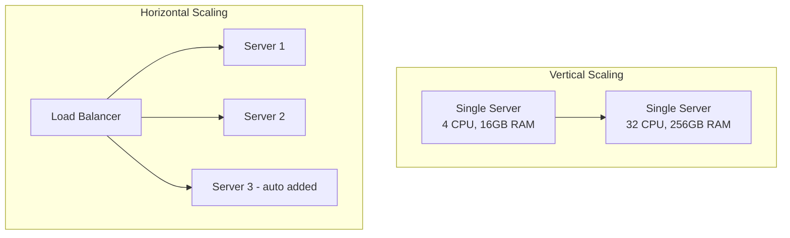

### 5. Architecture Flow

**Horizontal scaling flow:**
1. Load spikes — CPU usage rises across existing instances.
2. Auto-scaling policy triggers: "add 2 instances when CPU > 70%".
3. Cloud provider launches 2 new instances from a pre-defined AMI/image.
4. New instances pass health checks and are registered with the load balancer.
5. Load balancer starts routing traffic to the new instances.
6. After the spike subsides, auto-scaling terminates extra instances.

### 6. Real-World Example

- **Vertical**: Small startup scales from a 2-core to a 16-core database server.
- **Horizontal**: Netflix adds thousands of streaming servers during peak evening hours using AWS Auto Scaling.

### 7. Tools / Technologies Used

- **Horizontal**: AWS Auto Scaling, Kubernetes HPA (Horizontal Pod Autoscaler), GCP Managed Instance Groups.
- **Load balancers**: AWS ALB, Nginx, HAProxy.
- **Session externalization**: Redis (for stateless horizontal scaling).

### 8. Advantages

| | Vertical | Horizontal |
|---|---|---|
| Simplicity | Simple (no app changes) | Requires stateless design |
| Cost | Expensive hardware | Cheaper commodity servers |
| Ceiling | Hardware limits | Virtually unlimited |
| Downtime during scale | Often required | Zero downtime |

### 9. Disadvantages

| | Vertical | Horizontal |
|---|---|---|
| Limit | Physical hardware cap | Distributed complexity |
| SPOF | Yes — one machine | Reduced via multiple nodes |
| Cost efficiency | Diminishing returns | Better at scale |

### 10. Comparison Table

| Factor | Vertical Scaling | Horizontal Scaling |
|---|---|---|
| How | Bigger single machine | More machines |
| Complexity | Low | High (distributed systems) |
| Downtime | Often required | Not required |
| Limit | Hardware ceiling | Practically unlimited |
| Cost | High per unit | Commodity hardware |
| Best for | Databases (initially) | Stateless web/API tiers |

### 11. Company Workflow Example

**Twitter handling Super Bowl traffic:**

1. Baseline: 100 API server instances run 24/7.
2. Engineers predict tweet volume spikes 10× during the Super Bowl.
3. Auto-scaling groups are pre-configured with max capacity of 1,000 instances.
4. During halftime: tweet rate spikes — CPU rises above threshold.
5. Auto-scaling launches 900 additional API instances within minutes.
6. Load balancers distribute incoming tweets evenly.
7. Game ends: traffic drops — auto-scaling terminates the extra 900 instances.
8. Savings: only paid for the extra instances during the ~4-hour event.

---
## 13. Load Balancer

### 1. Simple Definition

A **Load Balancer** is a device or software that distributes incoming network traffic across multiple servers to ensure no single server is overwhelmed. It monitors server health and routes traffic only to healthy instances.

Think of it like a traffic officer at a busy intersection — directing vehicles to different lanes so no single road gets jammed.

### 2. Why It Is Used

- Prevents any single server from becoming a bottleneck.
- Provides high availability — if one server fails, traffic is automatically rerouted.
- Enables zero-downtime deployments by draining traffic from servers before updates.
- Improves response times by spreading load.

### 3. How It Works (Step-by-Step)

1. Client sends a request to the load balancer's IP/domain (the client never knows backend IPs).
2. Load balancer applies a routing algorithm to select a backend server.
3. Load balancer forwards the request to the selected server.
4. Backend processes the request and responds.
5. Load balancer passes the response back to the client (Layer 7) or the server responds directly (Layer 4 DSR mode).
6. Health checks continuously probe backend servers — unhealthy ones are removed from rotation.

### 4. Visual Diagram

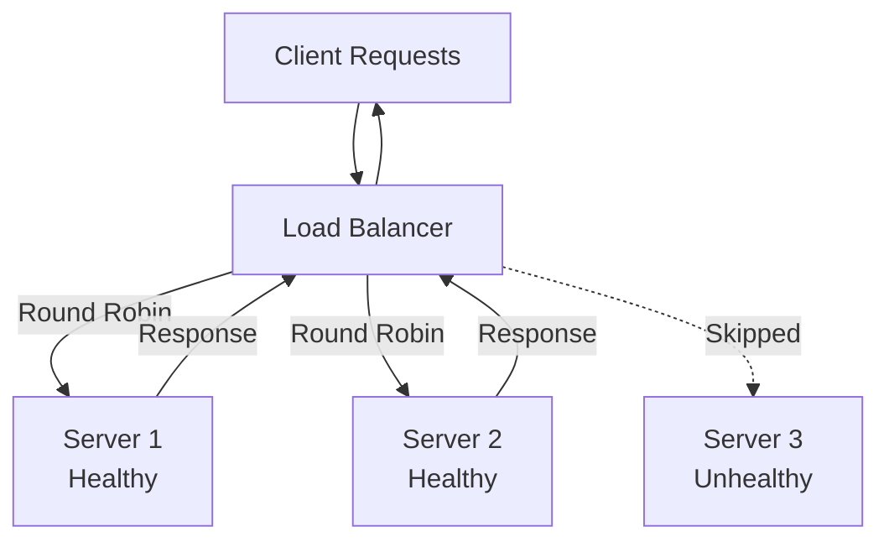

### 5. Architecture Flow

1. **DNS**: Domain resolves to the load balancer's IP.
2. **Layer 4 (TCP)**: Load balancer routes based on IP and port without inspecting content.
3. **Layer 7 (HTTP)**: Load balancer inspects URLs, cookies, and headers for smart routing.
4. **Session persistence (sticky sessions)**: If required, routes the same client to the same server using a cookie or IP hash.
5. **Health checks**: Periodic HTTP/TCP probes confirm server availability.

### 6. Real-World Example

- **Daily life**: When thousands of people access YouTube simultaneously, Google's load balancers distribute requests across data centers worldwide.
- **Company example**: AWS Elastic Load Balancer (ELB) automatically scales capacity and routes traffic across EC2 instances, Lambda, and containers.

### 7. Tools / Technologies Used

- **Software**: Nginx, HAProxy, Envoy.
- **Cloud**: AWS ALB/NLB, GCP Cloud Load Balancing, Azure Load Balancer.
- **DNS-based**: Route 53 weighted routing, Cloudflare Load Balancing.

### 8. Advantages

- Eliminates single point of failure.
- Transparent to clients.
- Enables rolling deployments and blue/green deployments.
- Auto-scaling integration for elastic capacity.

### 9. Disadvantages

- The load balancer itself must be made highly available (active-passive or active-active pair).
- Sticky sessions can create uneven load distribution.
- Layer 7 load balancers consume more CPU than Layer 4.

### 10. Comparison Table

| Algorithm | How It Works | Best For |
|---|---|---|
| Round Robin | Requests distributed in order | Equal server capacity |
| Least Connections | Routes to the server with fewest active connections | Long-lived connections |
| Weighted Round Robin | Servers with higher weight get more traffic | Mixed server capacity |
| IP Hash | Client IP hashed to pick server | Sticky sessions |
| Least Response Time | Routes to the fastest responding server | Latency-sensitive workloads |

### 11. Company Workflow Example

**Uber load balancing for ride requests:**

1. Rider opens Uber app — HTTP request hits AWS ALB.
2. ALB routes the request to one of 50 API server instances using least-connections.
3. API instance handles the ride request.
4. Health check detects one instance is slow (high GC pause).
5. ALB removes the slow instance from the pool.
6. Traffic is redistributed to remaining 49 healthy instances.
7. DevOps restarts the slow instance — passes health check.
8. ALB automatically re-adds it to the pool.

---

## 14. Database Indexing

### 1. Simple Definition

A **database index** is a data structure that improves the speed of data retrieval. Without an index, the database must scan every row in a table to find matching records — a **full table scan**. An index allows the database to jump directly to the relevant rows.

Think of it like the index at the back of a book: instead of reading every page to find a topic, you look it up in the index to get the exact page number.

### 2. Why It Is Used

- Dramatically speeds up `SELECT` queries with `WHERE`, `ORDER BY`, or `JOIN` conditions.
- Essential for performance at scale — a full scan on millions of rows can take seconds; an indexed lookup takes microseconds.
- Enables efficient sorting and range queries.

### 3. How It Works (Step-by-Step)

1. DBA or developer creates an index: `CREATE INDEX idx_email ON users(email)`.
2. Database builds a **B-tree** (or other structure) on the `email` column.
3. The B-tree is stored separately from the table data.
4. When a query runs `WHERE email = 'user@example.com'`:
   - Database traverses the B-tree in O(log n) time.
   - Finds the pointer (row ID / primary key) for matching rows.
   - Fetches the full row from the table using the pointer.
5. Without an index: database scans all rows — O(n) time.

### 4. Visual Diagram

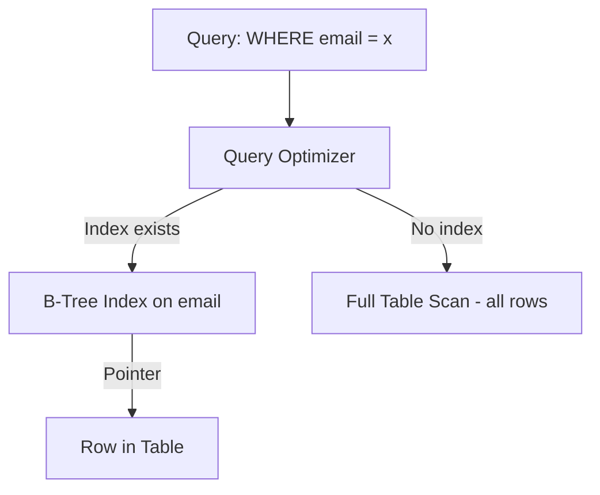

### 5. Architecture Flow

1. Query arrives at the database engine.
2. Optimizer checks if a suitable index exists for the query predicates.
3. If yes: index traversal → row pointer → row fetch.
4. If no: full sequential table scan.
5. For composite indexes, the leftmost prefix rule applies.
6. The optimizer can also perform **index-only scans** if all needed columns are in the index (covering index).

### 6. Real-World Example

- **Daily life**: Searching for a product by SKU on an e-commerce site — the database uses an index on the `sku` column to find the product in milliseconds.
- **Company example**: GitHub indexes repository names and owner IDs so that repository lookups are instant even with hundreds of millions of repositories.

### 7. Tools / Technologies Used

- **Index types**: B-tree (default), Hash (equality only), GIN (full-text, arrays), GiST (spatial).
- **Databases**: PostgreSQL, MySQL, Oracle, SQL Server.
- **Analysis tools**: `EXPLAIN ANALYZE` (PostgreSQL/MySQL), `SHOW EXECUTION PLAN` (SQL Server), pgBadger.

### 8. Advantages

- Orders-of-magnitude faster read queries.
- Enables efficient range queries and sorting.
- Supports unique constraint enforcement.

### 9. Disadvantages

- Every write (INSERT, UPDATE, DELETE) must also update all relevant indexes — increases write latency.
- Indexes consume additional disk space.
- Too many indexes on a write-heavy table can severely degrade write performance.
- Indexes must be maintained (bloat, unused indexes should be dropped).

### 10. Comparison Table

| Index Type | Structure | Best For |
|---|---|---|
| B-Tree | Balanced tree | Equality, range queries, sorting |
| Hash | Hash table | Equality queries only |
| Composite | B-Tree on multiple columns | Multi-column WHERE clauses |
| Partial | Index on subset of rows | Sparse data (e.g., active users only) |
| Full-Text | Inverted index | Text search queries |
| Covering Index | Includes all query columns | Index-only scans, zero table access |

### 11. Company Workflow Example

**E-commerce order search optimization:**

1. Operations team reports: `SELECT * FROM orders WHERE customer_id = 123 ORDER BY created_at DESC` takes 8 seconds.
2. `EXPLAIN ANALYZE` reveals: full table scan on 50 million rows.
3. DBA creates a composite index: `CREATE INDEX idx_orders_customer_created ON orders(customer_id, created_at DESC)`.
4. Database rebuilds the B-tree index (one-time cost).
5. Same query now takes 2ms — uses the index to find the 50 rows matching `customer_id = 123`, already sorted by `created_at`.
6. Write operations on `orders` now take slightly longer, but the trade-off is acceptable for this read-heavy table.

---

## 15. Replication

### 1. Simple Definition

**Replication** is the process of copying and synchronizing data from one database server (the **primary/leader**) to one or more other servers (the **replicas/followers**). All replicas maintain copies of the same data.

Think of it like a document stored in multiple cloud locations — if one location fails, others still have the file.

### 2. Why It Is Used

- **High availability**: If the primary fails, a replica can be promoted.
- **Read scaling**: Read queries can be distributed across replicas.
- **Disaster recovery**: Replicas in different regions survive datacenter failures.
- **Zero-downtime backups**: Take backups from a replica without affecting the primary.

### 3. How It Works (Step-by-Step)

1. All **writes** go to the primary database.
2. Primary records changes in a **replication log** (WAL in PostgreSQL, binlog in MySQL).
3. Replicas connect to the primary and stream the replication log.
4. Each replica applies the log entries to its own copy of the data.
5. **Reads** can be served by any replica (with possible staleness in async mode).
6. If the primary fails, a replica is elected/promoted as the new primary (failover).

### 4. Visual Diagram

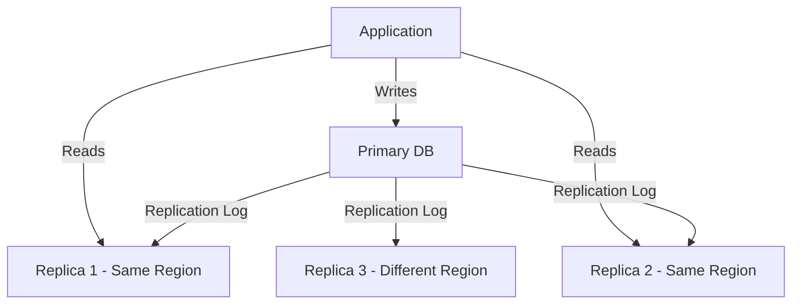

### 5. Architecture Flow

1. Write arrives at primary.
2. Primary executes write and appends to the replication log.
3. **Synchronous replication**: Primary waits for at least one replica to acknowledge before confirming to the client. Stronger consistency, higher write latency.
4. **Asynchronous replication**: Primary confirms immediately; replicas catch up in background. Lower write latency, risk of data loss on primary failure.
5. Replica applies changes; a small lag may exist (replication lag).

### 6. Real-World Example

- **Daily life**: Google Docs is replicated across multiple data centers — your document is safe even if one data center has an outage.
- **Company example**: AWS RDS with Multi-AZ uses synchronous replication to a standby replica. Automated failover happens in 60–120 seconds if the primary fails.

### 7. Tools / Technologies Used

- **PostgreSQL**: Streaming replication, logical replication.
- **MySQL**: Binary log replication, GTID-based replication.
- **Cloud Managed**: AWS RDS Multi-AZ, Aurora Global Database, Google Cloud SQL.
- **Monitoring**: `pg_stat_replication`, `SHOW SLAVE STATUS` (MySQL).

### 8. Advantages

- Provides high availability and fault tolerance.
- Scales read throughput horizontally.
- Enables geographic distribution for lower read latency.
- Supports point-in-time recovery.

### 9. Disadvantages

- **Replication lag**: Replicas may serve slightly stale data.
- **Failover complexity**: Promoting a replica requires coordination.
- **Write scaling**: Replication does not help with write-heavy workloads (all writes still go to one primary).
- Storage costs multiply with number of replicas.

### 10. Comparison Table

| Type | How | Consistency | Write Latency | Use Case |
|---|---|---|---|---|
| Synchronous | Primary waits for replica ACK | Strong | Higher | Financial data |
| Asynchronous | Primary does not wait | Eventual | Lower | Read-heavy apps |
| Semi-synchronous | Wait for at least one replica | Balanced | Moderate | General purpose |
| Logical replication | Replicates specific tables/rows | Flexible | Low | Migrations, selective replication |

### 11. Company Workflow Example

**Instagram read scaling with replication:**

1. Instagram has one primary PostgreSQL instance and 10 read replicas.
2. User uploads a photo: write goes to the primary.
3. Primary replicates the new row to all 10 replicas asynchronously.
4. Millions of users loading their feed send read queries to replicas.
5. Traffic router (PgBouncer or application logic) distributes reads across replicas.
6. Replicas may be 1–500ms behind the primary — acceptable for feed reads.
7. Primary's disk IOPS are reserved for writes only — dramatically reducing write contention.

---

## 16. Sharding

### 1. Simple Definition

**Sharding** (also called **Horizontal Partitioning**) is a technique for splitting a large database into smaller, faster, and more manageable pieces called **shards**. Each shard contains a subset of the total data and runs on a separate database server.

Think of it as dividing a phone book into multiple volumes (A–F, G–M, N–Z) so each volume is smaller and easier to search.

### 2. Why It Is Used

- A single database server has limits on storage, CPU, and RAM.
- Sharding allows a database to scale beyond single-machine limits.
- Distributes both read and write load across multiple machines.
- Reduces the size of each dataset, improving query performance.

### 3. How It Works (Step-by-Step)

1. A **shard key** is chosen (e.g., `user_id`, `region`, `customer_id`).
2. A **routing layer** determines which shard holds the data for a given key.
3. Common routing strategies:
   - **Range-based**: users 1–1M → shard 1, 1M–2M → shard 2.
   - **Hash-based**: `shard = hash(user_id) % num_shards`.
   - **Directory-based**: a lookup table maps keys to shards.
4. Writes and reads are routed to the correct shard.
5. Cross-shard queries require scatter-gather — querying all shards and merging results.

### 4. Visual Diagram

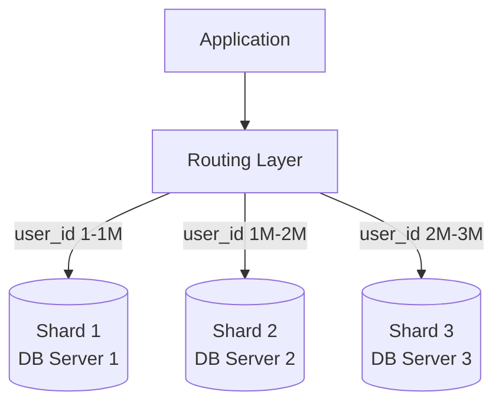

### 5. Architecture Flow

1. Application needs to fetch data for `user_id = 1500000`.
2. Routing layer computes shard: `hash(1500000) % 3 = 1` → Shard 2.
3. Query is sent to Shard 2's database server.
4. Shard 2 executes the query on its local dataset.
5. Result returned to the application.
6. For cross-shard queries (e.g., "users aged > 30 across all shards"): query sent to all shards, results merged.

### 6. Real-World Example

- **Daily life**: WhatsApp shards messages by phone number — your chat history lives on a specific shard assigned to your number.
- **Company example**: MongoDB Atlas uses automatic sharding. DynamoDB partitions data automatically using its partition key as a sharding mechanism.

### 7. Tools / Technologies Used

- **Native**: MongoDB (built-in sharding), Cassandra (consistent hashing), DynamoDB.
- **Manual/Middleware**: Vitess (MySQL sharding), Citus (PostgreSQL sharding).
- **Application-level**: Custom shard routing in application code.

### 8. Advantages

- Enables horizontal scaling beyond single-machine limits.
- Distributes write load across multiple machines.
- Reduces query time by operating on smaller datasets.

### 9. Disadvantages

- Cross-shard queries are complex and slow.
- Resharding (rebalancing) is operationally challenging.
- Distributed transactions across shards are very difficult.
- Poor shard key selection causes **hotspots** (uneven load).

### 10. Comparison Table

| Strategy | How Keys Map to Shards | Pros | Cons |
|---|---|---|---|
| Range-based | Ordered key ranges | Simple, range queries easy | Hotspots for sequential keys |
| Hash-based | Hash function | Uniform distribution | Range queries require scatter-gather |
| Directory-based | Lookup table | Flexible | Lookup table is a bottleneck |
| Geographic | User's region | Data locality, compliance | Uneven region sizes |

### 11. Company Workflow Example

**Discord sharding message storage:**

1. Discord stores trillions of messages using Cassandra.
2. Shard key is `channel_id` + `timestamp bucket`.
3. Each Cassandra node is responsible for a range of tokens (hash ring).
4. User sends a message to channel `#general`: routed to the node owning that channel's token.
5. Message is written and replicated to 3 nodes for durability.
6. User scrolls back through history: query routed to the same shard by channel ID.
7. New node added to cluster: consistent hashing redistributes a portion of data automatically.

---

## 17. Vertical Partitioning

### 1. Simple Definition

**Vertical Partitioning** splits a single table into multiple tables by columns. Instead of one wide table with many columns, you create narrower tables — each containing a subset of columns from the original.

Think of it like splitting a thick folder with mixed documents into separate folders — one for contracts, one for invoices, one for photos.

### 2. Why It Is Used

- Improves query performance by reducing the amount of data read per query.
- Separates frequently accessed columns from rarely accessed ones.
- Allows different security or compliance policies for sensitive columns.
- Reduces I/O for common operations that only need a few columns.

### 3. How It Works (Step-by-Step)

1. Analyze query patterns to identify which columns are accessed together.
2. Identify "hot" columns (frequently read) and "cold" columns (rarely read or large).
3. Split the original table into two or more tables with a shared primary key.
4. Queries targeting hot columns only read the smaller, faster table.
5. For operations needing all data, JOIN the partitioned tables using the shared key.

### 4. Visual Diagram

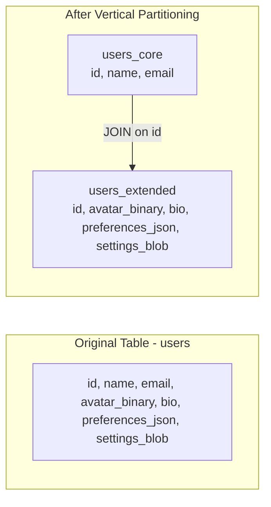

### 5. Architecture Flow

1. API request to display user profile header: `SELECT name, email FROM users_core WHERE id = 42`.
2. Database reads only the small `users_core` table — 3 columns per row.
3. API request to display full profile settings: `SELECT * FROM users_extended WHERE id = 42`.
4. Large blob fields only loaded when explicitly needed.
5. `users_core` fits more rows per disk page → better cache utilization → faster queries.

### 6. Real-World Example

- **Daily life**: A hospital system separates a patient's basic info (name, DOB, ward) from medical records (scan images, lab results). Basic info is fast to load; scans are only fetched when needed.
- **Company example**: Salesforce applies vertical partitioning to separate frequently queried CRM fields from large text fields, improving list view performance.

### 7. Tools / Technologies Used

- **Relational DBs**: PostgreSQL, MySQL — through schema design.
- **Cloud DBs**: BigQuery and Redshift are **columnar** databases, which apply vertical storage inherently for analytics.
- **ORM patterns**: Lazy loading (Hibernate, SQLAlchemy) fetches related columns only when accessed.

### 8. Advantages

- Faster queries for operations that don't need all columns.
- Better cache utilization (more rows fit in memory).
- Independent access controls for sensitive columns.
- Reduces I/O when large columns (BLOBs, JSON) are separated.

### 9. Disadvantages

- JOINs required for full-row queries — can add latency.
- Increases schema complexity.
- Updates to multiple partitions require coordinated writes.

### 10. Comparison Table

| Aspect | Horizontal Partitioning (Sharding) | Vertical Partitioning |
|---|---|---|
| Split by | Rows | Columns |
| Purpose | Distribute data volume | Separate column access patterns |
| Query impact | Reduces row count per shard | Reduces column count per query |
| Join needed? | For cross-shard queries | For full-row queries |
| Use case | High data volume | Wide tables, mixed access patterns |

### 11. Company Workflow Example

**LinkedIn vertical partitioning for user data:**

1. Original `members` table has 80+ columns including profile text, settings, privacy flags, and connection counts.
2. List view of search results only needs: `id, name, headline, photo_url`.
3. LinkedIn creates `members_core` with the 10 most frequently accessed columns.
4. `members_extended` contains the remaining 70 columns.
5. Search results query runs against `members_core` only — 10× less data per row.
6. Full profile page JOINs both tables.
7. Result: search list view loads 3× faster due to reduced I/O and better buffer cache utilization.

---
## 18. Caching (All Patterns)

### 1. Simple Definition

**Caching** stores a copy of data in a fast-access layer (usually in memory) so future requests for the same data can be served without hitting the slower backend (database, API).

Think of it like keeping a textbook open on your desk to the page you use most — instead of walking to the library every time, you reach for the open book.

### 2. Why It Is Used

- Reduces database load.
- Dramatically lowers response latency.
- Handles traffic spikes by serving repeated reads from memory.
- Reduces costs by decreasing database queries.

### 3. How It Works (Step-by-Step)

Behavior depends on the caching pattern used. The four primary patterns are described below.

---

#### Pattern A: Cache-Aside (Lazy Loading)

The application code manages the cache explicitly.

1. Request arrives.
2. Application checks cache — **cache hit**: return data directly.
3. **Cache miss**: application queries the database.
4. Application writes the result to the cache.
5. Application returns data to the caller.

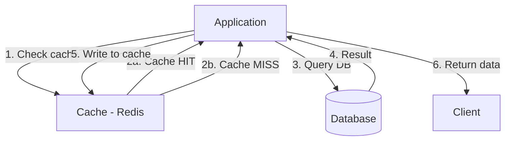

**Best for**: Read-heavy workloads where data is requested frequently but written infrequently.

---

#### Pattern B: Read-Through

The cache sits in front of the database and handles fetching automatically.

1. Application reads from cache.
2. **Cache hit**: return data.
3. **Cache miss**: cache automatically fetches from database, stores it, then returns.
4. Application always only talks to the cache.

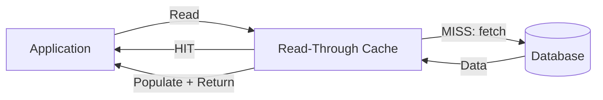

**Best for**: When the cache provider natively supports this (e.g., AWS ElastiCache with DAX for DynamoDB).

---

#### Pattern C: Write-Through

Every write to the cache is simultaneously written to the database.

1. Application writes data to cache.
2. Cache synchronously writes to database.
3. Both cache and database are always in sync.
4. Reads always hit the cache first.

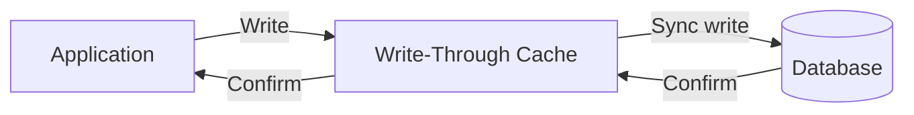

**Best for**: Situations where consistency between cache and database is required (e.g., user sessions, inventory counts).

---

#### Pattern D: Write-Back (Write-Behind)

Writes go to the cache immediately; the database is updated asynchronously.

1. Application writes to cache — returns immediately.
2. Cache acknowledges the write.
3. Cache asynchronously flushes writes to the database in batches.

```mermaid
graph LR
    APP[Application] -->|Write| CACHE[Write-Back Cache]
    CACHE -->|Immediate ACK| APP
    CACHE -->|Async batch flush| DB[(Database)]
```

**Best for**: High-write workloads where database write latency is a bottleneck (e.g., game leaderboards, click counters).

**Risk**: Data loss if cache fails before flush.

---

#### Pattern E: Write-Around

Writes go directly to the database, bypassing the cache. Only reads populate the cache.

1. Application writes directly to database.
2. On subsequent read, cache miss fetches from DB and populates cache.

**Best for**: Write-once, read-rarely data (e.g., logs, audit records).

---

### 4. Visual Diagram (Overview)

```mermaid
graph TD
    PATTERNS[Caching Patterns]
    PATTERNS --> CA[Cache-Aside\nApp manages cache]
    PATTERNS --> RT[Read-Through\nCache fetches from DB]
    PATTERNS --> WT[Write-Through\nWrite to cache + DB sync]
    PATTERNS --> WB[Write-Back\nWrite cache then async DB]
    PATTERNS --> WA[Write-Around\nBypass cache on write]
```

### 5. Architecture Flow

1. Identify hot data (frequently accessed data).
2. Choose a cache pattern based on read/write ratio and consistency needs.
3. Deploy a caching layer (Redis, Memcached).
4. Define TTL (Time-To-Live) for cache entries.
5. Design cache invalidation strategy (TTL expiry, event-driven invalidation, or version key).

### 6. Real-World Example

- **Cache-Aside**: Facebook caches user profile data in Memcached; on profile update, the cache entry is invalidated.
- **Write-Through**: Amazon ElastiCache + DynamoDB Accelerator (DAX) keeps shopping cart data consistent.
- **Write-Back**: Twitter uses Redis write-back for tweet counters (likes, retweets) to avoid high-frequency database writes.

### 7. Tools / Technologies Used

- **Redis**: In-memory data structure store — most popular caching solution.
- **Memcached**: Simple, high-throughput key-value cache.
- **AWS ElastiCache**: Managed Redis / Memcached.
- **Varnish**: HTTP-level caching reverse proxy.
- **CDN edge cache**: Cloudflare, AWS CloudFront (for HTTP responses).

### 8. Advantages

- Reduces database load by orders of magnitude.
- Dramatically lowers response latency.
- Absorbs read traffic spikes without scaling the database.

### 9. Disadvantages

- **Cache invalidation** is famously difficult — stale data is a persistent risk.
- Cache misses add latency (cache miss + DB query).
- Write-back risks data loss.
- Additional infrastructure to manage.

### 10. Comparison Table

| Pattern | Write Destination | Read Source | Consistency | Write Latency | Best For |
|---|---|---|---|---|---|
| Cache-Aside | DB (by app) | Cache, then DB | Eventual | Normal | Read-heavy, flexible |
| Read-Through | DB (by cache) | Cache only | Eventual | Normal | Transparent caching |
| Write-Through | Cache + DB (sync) | Cache | Strong | Higher | Balanced read/write |
| Write-Back | Cache first, DB async | Cache | Eventual | Very low | Write-heavy |
| Write-Around | DB directly | Cache (after miss) | Strong | Normal | Write-once data |

### 11. Company Workflow Example

**Netflix caching movie metadata:**

1. User searches for "The Dark Knight" — App checks Redis cache with key `movie:12345`.
2. **Cache hit**: JSON response returned in < 1ms.
3. Movie details are updated (new rating added).
4. Event triggers cache invalidation: Redis key `movie:12345` is deleted.
5. Next user request: **cache miss** — app fetches from Aurora database.
6. Fetched data written back to Redis with TTL of 1 hour.
7. Subsequent requests served from cache for 1 hour.
8. Result: 99% cache hit rate reduces database load by 50×.

---

## 19. CAP Theorem

### 1. Simple Definition

The **CAP Theorem** (also known as Brewer's Theorem) states that a distributed data system can guarantee at most **two** of the following three properties simultaneously:

- **C — Consistency**: Every read returns the most recent write.
- **A — Availability**: Every request receives a response (not necessarily the most recent data).
- **P — Partition Tolerance**: The system continues operating despite network failures that split nodes into isolated groups.

> In practice, **network partitions are unavoidable** in distributed systems. Therefore, every distributed system must tolerate partitions (P), and the real trade-off is between **Consistency (C)** and **Availability (A)** during a partition event.

### 2. Why It Is Used

Understanding CAP helps architects make informed decisions about which consistency guarantees are appropriate for a given use case.

### 3. How It Works (Step-by-Step)

1. System has two nodes: Node A and Node B, both storing the same data.
2. A network partition occurs — Node A and Node B cannot communicate.
3. A write arrives at Node A: "set balance = $100."
4. Node A must decide:
   - **CP choice**: Reject all reads until the partition heals and nodes re-sync. Returns an error. ← Consistency over Availability.
   - **AP choice**: Accept reads, but return possibly stale data (e.g., $90 from before the partition). ← Availability over Consistency.

### 4. Visual Diagram

```mermaid
graph TD
    CAP[CAP Theorem]
    CAP --> C[Consistency\nLatest data always returned]
    CAP --> A[Availability\nAlways get a response]
    CAP --> P[Partition Tolerance\nSurvives network splits]

    C -- "Must choose one during partition" --> A
    
    CP[CP Systems\nMongoDB, HBase, ZooKeeper]
    AP[AP Systems\nCassandra, DynamoDB, CouchDB]
    CA[CA Systems\nSingle-node RDBMS\nNot truly distributed]
```

### 5. Architecture Flow

**Normal operation (no partition):**
All three properties appear satisfied — nodes communicate freely, data is consistent, requests are served.

**During a partition:**
- **CP system**: Detects split — stops accepting writes or reads on the isolated node. Returns errors to maintain consistency.
- **AP system**: Continues accepting reads/writes on both sides of the partition. On recovery, runs conflict resolution to reconcile diverged state.

### 6. Real-World Example

- **CP**: Bank transfers — must be consistent. If there's a partition, the system refuses the transaction rather than risk a double-spend.
- **AP**: DNS — returns cached (possibly stale) responses during a network issue rather than failing all lookups.
- **Company example**: Amazon's DynamoDB defaults to AP (eventual consistency) but offers a strongly consistent read option (CP behavior per request).

### 7. Tools / Technologies Used

| Category | Tools |
|---|---|
| CP (Consistency + Partition) | ZooKeeper, HBase, MongoDB (strong), Google Spanner |
| AP (Availability + Partition) | Cassandra, CouchDB, DynamoDB (default), Riak |
| CA (Consistency + Availability, no partition) | Single-node PostgreSQL / MySQL (not distributed) |

### 8. Advantages

- Forces architects to explicitly choose consistency vs. availability.
- Guides technology selection for the right trade-off per domain.

### 9. Disadvantages

- CAP is a simplification — PACELC theorem extends it by considering latency vs. consistency even without a partition.
- Modern systems offer tunable consistency, blurring the strict CP/AP boundary.
- Does not cover all distributed system concerns (durability, performance, etc.).

### 10. Comparison Table

| Property | CP Systems | AP Systems |
|---|---|---|
| Availability during partition | May return errors | Always responds |
| Consistency | Strong | Eventual |
| Examples | ZooKeeper, HBase, Spanner | Cassandra, DynamoDB, CouchDB |
| Best for | Finance, inventory, coordination | Social, DNS, shopping carts |

### 11. Company Workflow Example

**Shopping cart: AP design at Amazon:**

1. Network partition splits East and West data centers.
2. User in East adds "Headphones" to cart — written to East node.
3. User in West (same account, different device) adds "Keyboard" to cart — written to West node.
4. AP system accepts both writes — cart shows different items on each side.
5. Partition heals — conflict resolution runs: merge both carts.
6. Final cart contains both "Headphones" and "Keyboard."
7. Amazon chose AP: it is better to allow conflicting cart additions (resolvable) than to block purchases (lost revenue).

---

## 20. Blob Storage

### 1. Simple Definition

**Blob Storage** (Binary Large Object Storage), also known as **Object Storage**, is a storage system for unstructured data such as images, videos, audio files, documents, and backups. Each piece of data is stored as an **object** with a unique key and metadata, inside a **bucket** or **container**.

Unlike a file system (which uses directories and file paths), object storage uses flat namespaces with unique keys.

### 2. Why It Is Used

- Stores large, unstructured files that don't fit in a relational database.
- Highly durable (data is automatically replicated across multiple locations).
- Cost-efficient for large volumes — far cheaper per GB than block storage.
- Accessible via simple HTTP APIs from anywhere.
- Lifecycle policies automatically archive or delete old objects.

### 3. How It Works (Step-by-Step)

1. Application uploads an object via an HTTP PUT request with the file data and metadata.
2. Object storage system generates (or uses a provided) unique key.
3. Object is stored and replicated across multiple storage nodes / availability zones.
4. A unique URL is generated: `https://bucket.s3.amazonaws.com/path/to/object.jpg`.
5. To read: HTTP GET request to the object URL.
6. Access can be restricted (private) or open (public) via access policies.

### 4. Visual Diagram

```mermaid
graph LR
    APP[Application] -->|PUT /bucket/image.jpg| OS[Object Storage\nAWS S3 / GCS / Azure Blob]
    OS -->|Replicate| N1[Node 1]
    OS -->|Replicate| N2[Node 2]
    OS -->|Replicate| N3[Node 3 - different zone]
    USER[User Browser] -->|GET URL| CDN[CDN Edge]
    CDN -->|Origin pull on miss| OS
```

### 5. Architecture Flow

1. User uploads a profile photo through the mobile app.
2. App sends the image binary to the API server.
3. API server writes the image to S3 with a unique key.
4. API server stores the object URL in the database (not the binary).
5. User's profile page loads — app requests the object URL from the database.
6. App renders the image using the URL (served via CDN).
7. S3 lifecycle policy moves objects older than 90 days to Glacier (cheaper cold storage).

### 6. Real-World Example

- **Daily life**: Every photo you post on Instagram is stored in object storage (AWS S3). You see it via a CDN-cached URL.
- **Company example**: Dropbox stores all user files in AWS S3 and their own in-house object storage (Magic Pocket) for cost optimization.

### 7. Tools / Technologies Used

- **AWS S3**: Most widely used object storage.
- **Google Cloud Storage (GCS)**: GCP's equivalent.
- **Azure Blob Storage**: Microsoft's equivalent.
- **MinIO**: Open-source, S3-compatible object storage.
- **Cloudflare R2**: S3-compatible with no egress fees.

### 8. Advantages

- Virtually unlimited scalability.
- 99.999999999% (11 nines) durability in services like S3.
- Low cost per GB vs. block or file storage.
- Globally accessible via HTTP APIs.
- Built-in versioning, lifecycle policies, and access controls.

### 9. Disadvantages

- Not suited for low-latency, random-access updates (use block storage for that).
- Eventual consistency in some operations (e.g., list operations after deletes).
- Not a substitute for a database — no querying capability.
- Egress costs can be significant for high-bandwidth workloads.

### 10. Comparison Table

| Feature | Block Storage (EBS) | File Storage (EFS/NFS) | Object Storage (S3) |
|---|---|---|---|
| Access method | Block-level (OS mount) | File path | HTTP API / unique key |
| Use case | Databases, OS disks | Shared file access | Media, backups, archives |
| Scalability | Limited to instance | High | Virtually unlimited |
| Cost per GB | High | Medium | Low |
| Random updates | Yes | Yes | No (overwrite entire object) |

### 11. Company Workflow Example

**Netflix storing video content:**

1. Content team uploads a raw 50GB video file to Netflix's ingest service.
2. Ingest service stores the raw file in AWS S3.
3. Transcoding pipeline reads from S3, encodes the file into 20+ resolutions and bitrates.
4. Each encoded variant stored back in S3 with a unique key.
5. Metadata (title, duration, thumbnails) stored in a database.
6. CDN (Netflix's Open Connect appliances) pulls video segments from S3 and caches them globally.
7. User stream request served from the nearest CDN cache node — S3 is only the origin.

---

## 21. Content Delivery Network (CDN)

### 1. Simple Definition

A **CDN (Content Delivery Network)** is a geographically distributed network of servers (**edge nodes** or **Points of Presence / PoPs**) that cache and serve content close to users. Instead of every user fetching content from a distant origin server, they receive it from the nearest edge node.

Think of it like a chain of local warehouses: instead of shipping products from a single central factory to every customer worldwide, you store inventory in local warehouses for faster delivery.

### 2. Why It Is Used

- Reduces latency — content served from the closest server.
- Reduces origin server load — edge nodes absorb most traffic.
- Improves availability — if the origin fails, cached content can still be served.
- Handles DDoS traffic at the edge.
- Improves global performance without replicating the entire application.

### 3. How It Works (Step-by-Step)

1. User requests `https://example.com/image.jpg`.
2. DNS for `example.com` resolves to the nearest CDN edge node (using Anycast or geo-routing).
3. Edge node checks its cache for `image.jpg`.
4. **Cache HIT**: Edge serves the file directly — very low latency.
5. **Cache MISS**: Edge fetches `image.jpg` from the origin server (S3 or web server).
6. Edge caches the file (respecting `Cache-Control` headers).
7. Edge serves the file to the user.
8. Subsequent requests from the same region are served from cache until TTL expires.

### 4. Visual Diagram

```mermaid
graph TD
    ORIGIN[Origin Server / S3]
    
    US[US Edge Node] -->|Cache miss: pull| ORIGIN
    EU[EU Edge Node] -->|Cache miss: pull| ORIGIN
    ASIA[Asia Edge Node] -->|Cache miss: pull| ORIGIN

    UA[US User] -->|Nearest edge| US
    UE[EU User] -->|Nearest edge| EU
    UASIA[Asia User] -->|Nearest edge| ASIA
```

### 5. Architecture Flow

1. Content owner uploads assets to origin (S3 bucket or web server).
2. CDN is configured with the origin URL.
3. `Cache-Control: max-age=86400` headers set content TTL to 24 hours.
4. First user in a region triggers a cache miss — CDN fetches and caches from origin.
5. All subsequent users in that region receive cached content.
6. On content update: CDN cache is purged via API or TTL expiry.

### 6. Real-World Example

- **Daily life**: Loading a YouTube video — the video is served from a CDN server in your city, not from a Google data center across the ocean.
- **Company example**: Cloudflare operates 300+ edge nodes. When a user visits a website protected by Cloudflare, static assets and cached HTML are served from the nearest PoP.

### 7. Tools / Technologies Used

- **Cloudflare**: CDN + DDoS protection + WAF.
- **AWS CloudFront**: Tightly integrated with S3, Lambda@Edge.
- **Fastly**: Real-time CDN with instant purging (used by GitHub, Slack).
- **Akamai**: Enterprise CDN, oldest and largest network.
- **Google Cloud CDN**: Integrated with GCP.

### 8. Advantages

- Dramatically reduces latency for global users.
- Offloads 90%+ of static traffic from origin.
- Built-in DDoS mitigation at the edge.
- Improves SEO (Google ranks fast-loading sites higher).

### 9. Disadvantages

- Stale content served if cache invalidation is misconfigured.
- Adds cost proportional to data transfer volume.
- Cache invalidation latency — purges may take seconds to propagate.
- Not suitable for highly personalized, non-cacheable content.

### 10. Comparison Table

| Content Type | CDN Suitable? | Notes |
|---|---|---|
| Images, CSS, JS | Yes | Long TTL, very high cache hit rate |
| Video streams | Yes | Chunk-level caching |
| HTML pages (static) | Yes | Short TTL; configure for right freshness |
| API responses | Partially | Short TTL or no cache for dynamic data |
| Authenticated content | Careful | Cache by user — risk of data leaks |
| Real-time data | No | Must hit origin |

### 11. Company Workflow Example

**GitHub serving code repositories via Fastly CDN:**

1. Developer visits `github.com/user/repo`.
2. DNS routes the request to the nearest Fastly PoP.
3. Fastly checks its cache for the repository page HTML.
4. **Cache miss** (first request): Fastly requests from GitHub's origin servers.
5. GitHub returns the rendered page with `Cache-Control: s-maxage=60`.
6. Fastly caches the page for 60 seconds.
7. During those 60 seconds: all requests for that page served from Fastly — GitHub origin sees no traffic.
8. Developer pushes a commit — GitHub calls Fastly's instant purge API.
9. Cache is invalidated; the next request fetches fresh content.

---
## 22. WebSockets

### 1. Simple Definition

**WebSockets** is a communication protocol that provides a **persistent, full-duplex (two-way)** connection between a client and a server over a single TCP connection. Unlike HTTP (which is request-response), WebSockets allow both sides to send data at any time without a new request.

Think of HTTP as sending letters back and forth. WebSockets is like a phone call — once connected, both parties can speak at any time.

### 2. Why It Is Used

- Required for real-time communication (chat, live updates, collaborative tools).
- Eliminates polling overhead — no need for repeated "Any updates?" requests.
- Reduces latency compared to long-polling or short-polling.
- Efficient for high-frequency, bidirectional data exchange.

### 3. How It Works (Step-by-Step)

1. Client sends an HTTP request with an `Upgrade: websocket` header.
2. Server responds with `101 Switching Protocols`.
3. The HTTP connection is upgraded to a WebSocket connection.
4. Both client and server can now send **frames** (messages) at any time.
5. Connection remains open until either side sends a close frame or the connection drops.
6. Application-layer heartbeat (ping/pong frames) keeps the connection alive.

### 4. Visual Diagram

```mermaid
sequenceDiagram
    participant C as Client
    participant S as Server

    C->>S: HTTP GET /chat (Upgrade: websocket)
    S->>C: 101 Switching Protocols
    Note over C,S: Persistent WebSocket Connection Established

    S->>C: Push: New message from Alice
    C->>S: Send: "Hello from Bob"
    S->>C: Push: User joined notification
    C->>S: Close frame
    S->>C: Close frame acknowledged
```

### 5. Architecture Flow

1. Client opens a WebSocket connection to `wss://chat.example.com/ws`.
2. Connection is routed through a load balancer (must use sticky sessions or a shared pub/sub broker).
3. WebSocket server maintains the connection in memory.
4. When a new message arrives for the user, the server pushes it over the open connection.
5. Client sends a message — server receives it, broadcasts to other connected clients.
6. Connection is maintained via periodic ping/pong.
7. On reconnect, client re-establishes the WebSocket connection and requests missed messages.

### 6. Real-World Example

- **Daily life**: Slack messages appear instantly in real-time because the Slack client maintains a WebSocket connection to Slack servers.
- **Company example**: Figma uses WebSockets to sync real-time collaborative edits between multiple users working on the same design simultaneously.

### 7. Tools / Technologies Used

- **Server libraries**: Socket.IO (Node.js), ws (Node.js), Django Channels (Python), Spring WebSocket (Java).
- **Managed**: AWS API Gateway WebSocket, Pusher, Ably.
- **Infrastructure**: Nginx (proxy_pass WebSocket), HAProxy.
- **Protocol**: `ws://` (unencrypted), `wss://` (encrypted over TLS).

### 8. Advantages

- True real-time bidirectional communication.
- Lower overhead compared to polling — no repeated HTTP headers.
- Server can push data to clients without a client request.
- Supports binary and text frames.

### 9. Disadvantages

- Stateful connections complicate horizontal scaling (connections are tied to a specific server).
- Requires a shared message broker (Redis Pub/Sub, Kafka) to fan out messages across servers.
- Firewalls and proxies may not support WebSocket upgrades.
- Connection management at scale (millions of open connections) is resource-intensive.

### 10. Comparison Table

| Feature | HTTP Polling | Long Polling | WebSocket | Server-Sent Events (SSE) |
|---|---|---|---|---|
| Direction | Client → Server only | Client → Server only | Bidirectional | Server → Client only |
| Latency | High | Medium | Very low | Low |
| Overhead | High | Medium | Low | Low |
| Real-time push | No | Partial | Yes | Yes |
| Use case | Simple status checks | Notifications | Chat, gaming, collab tools | Live feeds, notifications |

### 11. Company Workflow Example

**Slack real-time messaging:**

1. User opens Slack — client establishes WebSocket to `wss://ms-api.slack.com/`.
2. Slack's WebSocket farm has 1,000+ servers, each holding thousands of connections.
3. User A sends a message to channel #engineering.
4. Message is written to database and published to Redis Pub/Sub topic `channel:#engineering`.
5. All WebSocket servers subscribed to that topic receive the event.
6. Each server pushes the message to all connected clients in #engineering.
7. Recipients see the message in < 100ms despite connecting to different WebSocket servers.

---

## 23. Webhooks

### 1. Simple Definition

A **Webhook** is an HTTP callback: a mechanism where a service (producer) automatically sends an HTTP POST request to a pre-registered URL (consumer) when a specific event occurs.

Instead of the consumer repeatedly asking "Did anything happen?" (polling), the producer proactively notifies the consumer when something does happen.

Think of webhooks like a doorbell: instead of you constantly checking the door, the bell rings when someone arrives.

### 2. Why It Is Used

- Eliminates inefficient polling.
- Enables real-time event-driven integrations between services.
- Reduces API call volume and infrastructure load.
- Standard pattern for external integrations (payments, CI/CD, notifications).

### 3. How It Works (Step-by-Step)

1. Consumer registers a webhook URL with the producer: `POST /webhooks` with `{ url: "https://myapp.com/webhook", events: ["payment.succeeded"] }`.
2. Producer stores the URL and events.
3. Event occurs (e.g., payment is completed).
4. Producer sends an HTTP POST to `https://myapp.com/webhook` with an event payload (JSON).
5. Consumer receives the request, processes the event (e.g., fulfill the order).
6. Consumer responds with `200 OK`.
7. If consumer returns a non-2xx, producer retries with exponential backoff.

### 4. Visual Diagram

```mermaid
sequenceDiagram
    participant C as Consumer App
    participant P as Producer (e.g., Stripe)

    C->>P: Register webhook URL for payment.succeeded
    Note over P: Payment completes
    P->>C: POST /webhook { event: "payment.succeeded", amount: 99.99 }
    C->>P: 200 OK
    Note over C: Order fulfilled
    
    P->>C: POST (retry after timeout)
    C->>P: 200 OK (idempotent handling)
```

### 5. Architecture Flow

1. Producer's event system detects a state change.
2. Producer creates a webhook delivery job.
3. Delivery worker makes an HTTPS POST to the registered URL.
4. Request includes a signature header (e.g., `X-Stripe-Signature`) computed using a shared secret — allows consumer to verify authenticity.
5. Consumer processes the event idempotently (uses the event ID to avoid double-processing).
6. On timeout or 5xx response: producer queues a retry with exponential backoff (e.g., 5s, 30s, 5m, 30m, 2h).
7. After max retries: delivery is marked as failed; consumer can manually request replay.

### 6. Real-World Example

- **Daily life**: When a package is delivered by UPS, you receive an email or text. UPS's system fires a webhook to the notification service.
- **Company example**: GitHub fires webhook events when a pull request is opened, a push is made, or a release is published — triggering CI/CD pipelines in Jenkins, CircleCI, or GitHub Actions.

### 7. Tools / Technologies Used

- **Webhook platforms**: Stripe, Twilio, GitHub, Shopify, SendGrid, PagerDuty.
- **Testing webhooks**: ngrok (expose localhost to internet), webhook.site.
- **Delivery infrastructure**: Queue-backed (Kafka, SQS) + worker pool.
- **Signature verification**: HMAC-SHA256 with shared secret.

### 8. Advantages

- Event-driven — real-time notifications without polling.
- Reduces API traffic dramatically.
- Simple to implement for consumers (just expose an HTTP endpoint).
- Standard pattern supported by every major platform.

### 9. Disadvantages

- Consumer endpoint must be publicly reachable.
- Delivery is not guaranteed without retry logic.
- Consumer must implement idempotency (retries can deliver the same event twice).
- Debugging failed deliveries requires logging and monitoring.

### 10. Comparison Table

| Feature | Polling | Webhooks | WebSocket |
|---|---|---|---|
| Direction | Consumer pulls | Producer pushes | Bidirectional |
| Latency | High (depends on interval) | Near real-time | Real-time |
| Consumer overhead | High (frequent requests) | Low (wait for push) | Medium (connection maintenance) |
| Reliability | Consumer controls | Producer controls delivery | Application controls |
| Use case | Simple status checks | Event-driven integrations | Real-time data streams |

### 11. Company Workflow Example

**Stripe payment webhook flow:**

1. E-commerce site registers `https://shop.example.com/stripe-webhook` with Stripe.
2. Customer completes checkout — Stripe processes the payment.
3. Stripe sends `POST /stripe-webhook` with payload: `{ "type": "payment_intent.succeeded", "id": "pi_abc123", ... }`.
4. Shop's server verifies the `Stripe-Signature` header using HMAC-SHA256 and the webhook secret.
5. Server checks its database: "Has `pi_abc123` already been processed?" (idempotency check).
6. If not processed: create order, send confirmation email, reduce inventory.
7. Server responds `200 OK`.
8. If server was down: Stripe retries over 3 days with exponential backoff.
9. Shop recovers and processes all missed events from Stripe's event log.

---

## 24. Microservices vs Monolithic Architecture

### 1. Simple Definition

- **Monolithic Architecture**: The entire application — UI, business logic, and data access — is built and deployed as a single unit.
- **Microservices Architecture**: The application is decomposed into small, independently deployable services, each responsible for a specific business capability.

Think of a monolith as a single factory building that does everything. Microservices are like a campus of specialized buildings — each handles one function but works together.

### 2. Why It Is Used

- **Monolith**: Simple to build, test, and deploy for small teams or early-stage products.
- **Microservices**: Needed when teams, services, and deployment velocity scale to a point where a monolith becomes a bottleneck.

### 3. How It Works (Step-by-Step)

**Monolith:**
1. All code in one repository — a single deployable artifact.
2. All features share the same database.
3. A single deployment process updates everything.
4. Scaling requires scaling the entire application.

**Microservices:**
1. Each service is an independent process with its own code repository.
2. Services communicate via HTTP/REST, gRPC, or message queues.
3. Each service owns its own database (Database-per-Service pattern).
4. Services are deployed and scaled independently.

### 4. Visual Diagram

```mermaid
graph TD
    subgraph Monolithic
        M[Single Application]
        M --> UI1[UI Layer]
        M --> BL1[Business Logic]
        M --> DA1[Data Access]
        DA1 --> DB1[(Single Database)]
    end

    subgraph Microservices
        GW[API Gateway]
        GW --> US[User Service]
        GW --> OS[Order Service]
        GW --> PS[Payment Service]
        GW --> NS[Notification Service]
        US --> UDB[(User DB)]
        OS --> ODB[(Order DB)]
        PS --> PDB[(Payment DB)]
    end
```

### 5. Architecture Flow

**Microservices request flow (place an order):**
1. Client sends `POST /orders` to the API gateway.
2. API gateway authenticates via User Service.
3. API gateway routes to Order Service.
4. Order Service calls Payment Service (sync gRPC or async queue).
5. Payment Service processes payment, stores result in its own DB.
6. Order Service receives confirmation, writes order to Order DB.
7. Order Service publishes `order.placed` event to message queue.
8. Notification Service consumes event, sends confirmation email.

### 6. Real-World Example

- **Monolith**: Early-stage Shopify was a Rails monolith that scaled to support millions of merchants.
- **Microservices**: Amazon famously migrated from a monolith to microservices. Today each service (search, cart, recommendations, payments) is independently deployed.

### 7. Tools / Technologies Used

| Concern | Tools |
|---|---|
| Service communication | gRPC, REST, Kafka, RabbitMQ |
| Service discovery | Consul, Kubernetes DNS, Eureka |
| API gateway | Kong, AWS API Gateway, Nginx |
| Container orchestration | Kubernetes, ECS |
| Observability | Jaeger (tracing), Prometheus, ELK |
| Service mesh | Istio, Linkerd |

### 8. Advantages

| | Monolith | Microservices |
|---|---|---|
| Development speed (early) | Fast | Slower (infrastructure overhead) |
| Team independence | Low | High |
| Scaling granularity | Whole app | Per-service |
| Fault isolation | Low | High |
| Deployment frequency | Coupled | Independent |

### 9. Disadvantages

| | Monolith | Microservices |
|---|---|---|
| Scaling | Entire app must scale | Complex distributed system |
| Team bottleneck | High | Low |
| Deployment | All-or-nothing | Independent but complex |
| Testing | Simple end-to-end | Complex integration testing |
| Data consistency | Easy (one DB) | Complex (distributed transactions) |

### 10. Comparison Table

| Feature | Monolithic | Microservices |
|---|---|---|
| Codebase | Single repository | Multiple repositories |
| Deployment | One artifact | Many independent artifacts |
| Database | Shared | One per service |
| Scaling | Whole application | Individual services |
| Communication | In-process (function calls) | Network (REST, gRPC, queues) |
| Failure isolation | Low (one crash affects all) | High (isolated per service) |
| Operational complexity | Low | High |
| Best for | Early-stage, small teams | Large-scale, large teams |

### 11. Company Workflow Example

**Netflix migration from monolith to microservices:**

1. Netflix started as a DVD-by-mail service — a Ruby on Rails monolith.
2. 2008: monolith suffered a major database corruption outage — resolved to redesign.
3. 2009–2011: migrated to a microservices architecture on AWS.
4. Each capability became its own service: Recommendation Service, Billing Service, Streaming Service, A/B Testing Service, etc.
5. Each service deployed independently — 100+ deployments per day.
6. Chaos Engineering (Chaos Monkey) tests resilience by randomly killing services.
7. Result: Netflix operates at 99.99%+ availability serving 200M+ subscribers.

---
## 25. Message Queues

### 1. Simple Definition

A **Message Queue** is a form of asynchronous communication where a **producer** sends messages to a queue, and a **consumer** reads and processes those messages independently. The producer and consumer do not need to interact at the same time.

Think of it like a post office: you drop a letter (message) in the mailbox (queue), and the postal service (consumer) delivers it when ready — you don't wait at the mailbox.

### 2. Why It Is Used

- **Decoupling**: Producer and consumer are independent — neither needs to know about the other.
- **Resilience**: If a consumer crashes, messages stay in the queue and are processed when it recovers.
- **Load leveling**: Absorbs traffic spikes — consumers process at their own pace.
- **Ordering**: Some queues guarantee ordered processing (FIFO).
- **Fan-out**: One message delivered to multiple consumers.

### 3. How It Works (Step-by-Step)

1. Producer sends a message to the queue: `{ "orderId": 123, "action": "process" }`.
2. Message broker stores the message durably.
3. Consumer polls or receives a push notification from the queue.
4. Consumer processes the message.
5. Consumer acknowledges (ACKs) the message — broker removes it from the queue.
6. If consumer fails to ACK (crash), broker redelivers the message to another consumer.
7. After max retries, unprocessable messages are sent to a **Dead Letter Queue (DLQ)**.

### 4. Visual Diagram

```mermaid
graph LR
    P1[Producer: Order Service] -->|Publish| Q[Message Queue\nSQS / RabbitMQ / Kafka]
    P2[Producer: Payment Service] -->|Publish| Q
    Q -->|Consume| C1[Consumer: Fulfillment Worker]
    Q -->|Consume| C2[Consumer: Notification Worker]
    Q -->|Max retries exceeded| DLQ[Dead Letter Queue]
```

### 5. Architecture Flow

1. Order placed → Order Service publishes message to `orders.new` queue.
2. Multiple consumer types subscribe: Fulfillment Worker, Analytics Worker, Email Worker.
3. Each consumer independently processes the message.
4. Workers are scaled horizontally: 10 Fulfillment Workers share the queue — each processes different messages.
5. If Fulfillment Worker crashes mid-processing: message becomes visible again after visibility timeout.
6. Another Fulfillment Worker picks it up and reprocesses.
7. After 3 failed attempts: message sent to DLQ for manual inspection.

### 6. Real-World Example

- **Daily life**: When you book an Airbnb, a confirmation email is sent via a message queue — the booking is confirmed instantly, but the email is queued and sent asynchronously.
- **Company example**: Uber uses Kafka message streams to process real-time ride events (driver location updates, trip status changes) at millions of messages per second.

### 7. Tools / Technologies Used

| Tool | Type | Best For |
|---|---|---|
| AWS SQS | Managed Queue | Simple async task queues |
| RabbitMQ | Message Broker | Routing, topic-based delivery |
| Apache Kafka | Event Streaming | High-throughput, ordered, replayable |
| AWS SNS | Pub/Sub | Fan-out to multiple subscribers |
| Google Pub/Sub | Managed Pub/Sub | GCP-native event delivery |
| ActiveMQ | Message Broker | Enterprise messaging (JMS) |

### 8. Advantages

- Decouples services — independent deployments and scaling.
- Improves fault tolerance — messages persist if consumers fail.
- Smooths traffic spikes — queue absorbs bursts.
- Enables async workflows — no waiting for slow downstream services.

### 9. Disadvantages

- Adds operational complexity — another system to manage and monitor.
- Eventual consistency — consumers process asynchronously, so state is not immediately updated.
- Message ordering not always guaranteed (except FIFO queues or Kafka partitions).
- Consumer lag can accumulate if consumers are too slow.

### 10. Comparison Table

| Feature | Message Queue (SQS) | Event Stream (Kafka) |
|---|---|---|
| Message retention | Until consumed (or TTL) | Configurable (days/forever) |
| Replay | No | Yes |
| Ordering | FIFO option | Per-partition guarantee |
| Consumer model | Competing consumers | Consumer groups |
| Throughput | Medium | Very high |
| Best for | Task queues, jobs | Event sourcing, analytics, audit |

### 11. Company Workflow Example

**LinkedIn's activity feed using Kafka:**

1. User likes a post → Activity Service publishes `{ userId, action: "like", postId }` to Kafka topic `user-activity`.
2. Kafka stores the event durably across 3 broker replicas.
3. Three consumer groups read from the same topic independently:
   - **Feed Service**: Updates connection feeds.
   - **Notification Service**: Sends push notification to post author.
   - **Analytics Service**: Aggregates engagement metrics.
4. Each consumer group maintains its own offset — they process events at their own pace.
5. Analytics Service is 5 minutes behind — acceptable for analytics; Feed Service is near real-time.
6. If Notification Service crashes: its consumer group pauses; on restart it resumes from its last committed offset — no events lost.

---

## 26. Rate Limiting

### 1. Simple Definition

**Rate Limiting** is a technique that controls how many requests a client can make to a service within a defined time window. It protects services from abuse, overload, and ensures fair resource sharing.

Think of it like a water tap with a flow regulator — it limits how fast water can flow, preventing the pipe from bursting.

### 2. Why It Is Used

- Prevents API abuse and DDoS attacks.
- Ensures fair usage across all clients.
- Protects backend services from being overwhelmed.
- Enforces business-level quotas (free vs. paid tiers).

### 3. How It Works (Step-by-Step)

Four primary algorithms are used. Each is described below.

---

#### Algorithm A: Fixed Window

Divides time into fixed windows (e.g., 1-minute buckets) and counts requests per window.

1. Start of window: counter = 0.
2. Each request: increment counter.
3. If counter > limit: reject request with `429 Too Many Requests`.
4. At window boundary: reset counter to 0.

```mermaid
graph LR
    T1[00:00–01:00\nRequests: 98] --> T2[01:00–02:00\nRequests: 0 - Reset]
    R1[Request 99 at 00:59 - OK] --> T1
    R2[Request 100 at 00:59 - OK] --> T1
    R3[Request 101 at 00:59 - REJECTED] --> T1
```

**Problem**: Burst at window boundary — 100 requests at 00:59 and 100 at 01:01 = 200 requests in 2 seconds.

---

#### Algorithm B: Sliding Window

Tracks requests in a rolling time window to avoid boundary bursts.

1. Each request is timestamped.
2. On new request: count all requests within the last N seconds.
3. If count > limit: reject.
4. Old timestamps are expired continuously.

```mermaid
graph LR
    NOW[Current Time: 01:30]
    W[Sliding Window\n00:30 → 01:30]
    R[Count requests in window]
    NOW --> W --> R
    R -->|Count <= limit| ALLOW[Allow]
    R -->|Count > limit| DENY[Reject 429]
```

**Benefit**: Smooth rate limiting with no burst at boundaries.

---

#### Algorithm C: Token Bucket

Tokens are added to a bucket at a fixed rate. Each request consumes one token.

1. Bucket starts with `capacity` tokens (e.g., 100).
2. Tokens are added at rate R per second (e.g., 10/sec).
3. Each request consumes 1 token.
4. If bucket is empty: request is rejected.
5. Unused tokens accumulate up to `capacity` — allows bursting.

```mermaid
graph TD
    FILL[Token Refill\n10 tokens/sec] -->|Add tokens| BUCKET[Token Bucket\nMax: 100 tokens]
    REQ[Incoming Request] -->|Consume 1 token| BUCKET
    BUCKET -->|Token available| ALLOW[Allow Request]
    BUCKET -->|Empty| REJECT[Reject 429]
```

**Benefit**: Allows short bursts while maintaining a long-term average rate.

---

#### Algorithm D: Leaky Bucket

Requests enter a bucket (queue). The bucket leaks (processes) at a constant rate regardless of input speed.

1. Requests arrive at variable rates and queue in the bucket.
2. Bucket processes one request per time unit (constant rate).
3. If the bucket is full: new requests are dropped.
4. Smooths out bursty traffic into a constant output rate.

```mermaid
graph TD
    BURST[Bursty Incoming Requests] -->|Enqueue| BUCKET[Leaky Bucket Queue\nMax capacity: N]
    BUCKET -->|Constant drain rate| OUT[Processed Requests\nSmooth output]
    BUCKET -->|Full| DROP[Drop / Reject]
```

**Benefit**: Produces a constant output rate — protects downstream systems from bursts.

---

### 4. Visual Diagram (Comparison)

```mermaid
graph TD
    ALGOS[Rate Limiting Algorithms]
    ALGOS --> FW[Fixed Window\nSimple, burst risk at edges]
    ALGOS --> SW[Sliding Window\nSmooth, memory-intensive]
    ALGOS --> TB[Token Bucket\nAllows bursts, controls average]
    ALGOS --> LB[Leaky Bucket\nSmooth output, drops bursts]
```

### 5. Architecture Flow

1. Request arrives at API Gateway or rate limiter middleware.
2. Rate limiter identifies the client (API key, IP, user ID).
3. Rate limiter checks current count/tokens in a shared store (Redis).
4. If limit not exceeded: allow request, increment counter.
5. If limit exceeded: return `HTTP 429 Too Many Requests` with `Retry-After` header.
6. Counters stored in Redis with TTL equal to the window size.

### 6. Real-World Example

- **Daily life**: Twitter limits the number of tweets you can post per hour to prevent spam.
- **Company example**: GitHub's REST API limits unauthenticated requests to 60/hour and authenticated requests to 5,000/hour. The token bucket algorithm allows short bursts without penalizing normal usage.

### 7. Tools / Technologies Used

- **Redis**: Atomic increment operations (INCR + EXPIRE) for counter-based limiting.
- **NGINX**: `limit_req_zone` directive for IP-based rate limiting.
- **Kong**: API gateway with rate limiting plugin.
- **AWS API Gateway**: Built-in usage plans and throttling.
- **Envoy**: Rate limiting filter with external rate limit service integration.

### 8. Advantages

- Protects services from abuse and overload.
- Enables fair usage policies across clients.
- Prevents cascading failures from traffic spikes.

### 9. Disadvantages

- Legitimate users may be rejected during high-traffic events.
- Distributed rate limiting requires a shared state store (Redis) — adds latency.
- Complex to tune limits that balance protection and usability.

### 10. Comparison Table

| Algorithm | Burst Handling | Memory Usage | Accuracy | Complexity |
|---|---|---|---|---|
| Fixed Window | Boundary burst possible | Low | Medium | Very simple |
| Sliding Window | Smooth | Medium-High | High | Moderate |
| Token Bucket | Burst allowed (up to capacity) | Low | High | Moderate |
| Leaky Bucket | Burst absorbed, output smoothed | Low | High | Moderate |

### 11. Company Workflow Example

**Stripe API rate limiting with Token Bucket:**

1. Stripe assigns each merchant API key a token bucket with: capacity = 100 tokens, refill rate = 10 tokens/second.
2. Merchant's server sends 90 payment API calls in a burst.
3. Token bucket has 100 tokens — all 90 succeed (10 tokens remain).
4. Merchant sends 20 more requests immediately — only 10 tokens remain → 10 succeed, 10 rejected with `429`.
5. 1 second passes — 10 new tokens added → merchant's next batch succeeds.
6. For checkout traffic spikes (Black Friday): Stripe pre-warms higher limits for high-volume merchants.
7. All rate limit decisions made in Redis with sub-millisecond latency.

---

## 27. API Gateway

### 1. Simple Definition

An **API Gateway** is a server that acts as the single entry point for all client requests. It sits in front of all backend microservices and handles cross-cutting concerns such as authentication, rate limiting, routing, logging, and protocol translation.

Think of it like an airport control tower — every flight (request) must communicate with the tower (gateway) before landing (reaching a service).

### 2. Why It Is Used

- Provides a single, consistent entry point for all clients.
- Offloads cross-cutting concerns from individual services.
- Simplifies client code — clients talk to one endpoint, not dozens of services.
- Enables versioning, traffic splitting, and canary deployments.
- Handles protocol transformation (REST → gRPC, HTTP → WebSocket).

### 3. How It Works (Step-by-Step)

1. Client sends a request to the API gateway's URL.
2. Gateway validates the authentication token (JWT verification or OAuth introspection).
3. Gateway checks rate limiting for the client.
4. Gateway applies request routing: matches URL path to the corresponding backend service.
5. Gateway optionally transforms the request (adds headers, translates protocol).
6. Gateway forwards the request to the backend service.
7. Backend responds to the gateway.
8. Gateway optionally applies response transformation, compression, or logging.
9. Gateway returns the response to the client.

### 4. Visual Diagram

```mermaid
graph TD
    MOB[Mobile App] --> GW[API Gateway]
    WEB[Web Browser] --> GW
    PARTNER[Partner API] --> GW

    GW -->|Authenticate| AUTH[Auth Service]
    GW -->|Rate check| RL[Rate Limiter - Redis]

    GW -->|/users/*| US[User Service]
    GW -->|/orders/*| OS[Order Service]
    GW -->|/products/*| PS[Product Service]
    GW -->|/payments/*| PAY[Payment Service]
```

### 5. Architecture Flow

1. **Authentication**: Gateway validates the Bearer token — rejects unauthenticated requests with `401`.
2. **Authorization**: Checks if the authenticated user has permission for the requested resource — `403` if not.
3. **Rate limiting**: Applies per-client quota.
4. **Routing**: Pattern-matches URL to a backend service.
5. **Load balancing**: Distributes traffic across multiple instances of the backend service.
6. **Request transformation**: Adds internal headers (e.g., `X-User-ID: 42`).
7. **Logging/Tracing**: Records request metadata; injects trace ID for distributed tracing.
8. **Response**: Returns backend response with gateway-applied headers.

### 6. Real-World Example

- **Daily life**: When you use a banking app, all requests go through a single secure API gateway that enforces authentication and logs every transaction.
- **Company example**: Netflix's Zuul (and later Zuul 2 + Envoy) acts as the API gateway for all client traffic — handling billions of requests per day across iOS, Android, Smart TV, and web clients.

### 7. Tools / Technologies Used

- **Open Source**: Kong, KrakenD, Traefik, Nginx.
- **Cloud Managed**: AWS API Gateway, Google Apigee, Azure API Management.
- **Service Mesh Gateway**: Istio Ingress Gateway, Envoy.
- **Authentication**: OAuth 2.0, OpenID Connect, JWT.

### 8. Advantages

- Single entry point simplifies client integration.
- Cross-cutting concerns managed in one place (no duplication across services).
- Enables canary releases and A/B testing via traffic splitting.
- Improves security by exposing only the gateway, not backend services.

### 9. Disadvantages

- Can become a single point of failure — must be deployed with high availability.
- Adds latency (one extra network hop).
- Gateway configuration complexity grows with the number of services.
- Can become a bottleneck if not properly scaled.

### 10. Comparison Table

| Feature | Without API Gateway | With API Gateway |
|---|---|---|
| Client entry points | Multiple service URLs | Single URL |
| Authentication | Each service implements it | Centralized in gateway |
| Rate limiting | Each service implements it | Centralized in gateway |
| Protocol support | Service-specific | Gateway handles translation |
| Observability | Per-service logs | Unified traffic logs |

### 11. Company Workflow Example

**Uber API Gateway handling ride request:**

1. Rider app sends `POST /v2/rides` to Uber's API gateway.
2. Gateway reads the `Authorization: Bearer <token>` header.
3. Gateway calls the Token Validation Service — token is valid; user ID extracted.
4. Gateway checks rate limit for the user — within quota.
5. Gateway adds header `X-User-ID: 987654` and forwards to Ride Request Service.
6. Ride Request Service processes the ride — responds with ride details.
7. Gateway logs: request time, user ID, service, response code, latency.
8. Gateway injects trace ID into the response for observability.
9. Gateway returns JSON response to the Uber app.
10. If Ride Request Service is down: gateway returns a `503` with a retry-after hint.

---

## 28. Idempotency

### 1. Simple Definition

An operation is **idempotent** if performing it multiple times produces the same result as performing it once. In distributed systems, idempotency ensures that retried requests (due to network failures or timeouts) do not cause unintended side effects like duplicate charges or duplicate records.

Think of it like pressing an elevator button: pressing it once or ten times both result in the elevator coming to your floor. The extra presses have no additional effect.

### 2. Why It Is Used

- Networks are unreliable — requests can time out and be retried.
- Without idempotency, retries cause duplicate operations (double charges, duplicate emails, duplicate orders).
- Enables safe retry logic in clients and message processing systems.
- Critical for financial, order, and inventory systems.

### 3. How It Works (Step-by-Step)

1. Client generates a unique **idempotency key** (UUID) for each logical operation.
2. Client sends the request with the key in a header: `Idempotency-Key: 550e8400-e29b-41d4-a716-446655440000`.
3. Server receives the request and checks if this key exists in a deduplication store.
4. **First time**: Execute the operation, store the result in the deduplication store keyed by the idempotency key.
5. **Subsequent duplicates**: Return the stored result directly — do not re-execute.
6. Idempotency keys expire after a retention window (e.g., 24 hours).

### 4. Visual Diagram

```mermaid
sequenceDiagram
    participant C as Client
    participant S as Server
    participant KS as Key Store (Redis)
    participant DB as Database

    C->>S: POST /payments (Idempotency-Key: abc123)
    S->>KS: Check key "abc123"
    KS->>S: Key not found
    S->>DB: Process payment $99
    DB->>S: Success (paymentId: xyz)
    S->>KS: Store result for "abc123"
    S->>C: 200 OK (paymentId: xyz)

    Note over C: Network timeout - retry
    C->>S: POST /payments (Idempotency-Key: abc123)
    S->>KS: Check key "abc123"
    KS->>S: Found - return cached result
    S->>C: 200 OK (paymentId: xyz) - same result, no double charge
```

### 5. Architecture Flow

1. Client assigns a UUID idempotency key per logical operation.
2. Server receives request — first checks Redis for the key.
3. **Cache miss**: Execute business logic, commit to database, write result to Redis with TTL.
4. **Cache hit**: Return cached result immediately.
5. For message queues: consumers track processed message IDs in a deduplication store.
6. Message redelivered after consumer crash: consumer checks the store — skips if already processed.

### 6. Real-World Example

- **Daily life**: Clicking "Submit Payment" twice on a shopping site — thanks to idempotency, only one charge is processed.
- **Company example**: Stripe requires clients to pass an `Idempotency-Key` header for all POST requests. The key is stored for 24 hours, guaranteeing safe retries.

### 7. Tools / Technologies Used

- **Key storage**: Redis (fast, TTL-based expiry), PostgreSQL (for durable key storage).
- **UUID generation**: `uuid` libraries in all major languages.
- **Message deduplication**: AWS SQS FIFO queues (built-in message deduplication IDs), Kafka (consumer offset tracking).
- **Frameworks**: Stripe SDK (automatic idempotency key injection on retry).

### 8. Advantages

- Enables safe automatic retries — drastically simplifies client error handling.
- Prevents data corruption from duplicate requests.
- Critical for financial correctness and order integrity.

### 9. Disadvantages

- Requires additional storage for the deduplication key store.
- Key TTL management — too short risks missing late retries; too long increases storage.
- Complex for operations with non-deterministic side effects.

### 10. Comparison Table

| HTTP Method | Naturally Idempotent? | Reason |
|---|---|---|
| GET | Yes | Read-only — no side effects |
| PUT | Yes | Replaces resource — same result every time |
| DELETE | Yes | Deleting an already-deleted resource is a no-op |
| POST | No | Creates new resources — retries create duplicates |
| PATCH | Sometimes | Depends on operation (set vs. increment) |

### 11. Company Workflow Example

**Stripe payment idempotency in practice:**

1. E-commerce checkout backend generates `idempotencyKey = UUID()` when user clicks "Pay."
2. Backend calls `POST /v1/payment_intents` with `Idempotency-Key: <uuid>`.
3. Stripe processes the payment and stores the result against the key.
4. Response is lost due to a network timeout.
5. Backend's retry logic triggers — same request sent with the same idempotency key.
6. Stripe looks up the key: result already exists → returns the original response.
7. No second charge is processed.
8. Backend receives the payment confirmation and fulfills the order.
9. Key expires after 24 hours — after that, a new payment intent would need a new key.

---

## 29. Denormalization

### 1. Simple Definition

**Denormalization** is the process of intentionally adding redundancy to a database by duplicating data across tables (or within documents). It is the opposite of normalization (which eliminates redundancy). Denormalization trades storage efficiency and write complexity for **faster read performance**.

Think of it like keeping a summary sheet on your desk that has all the key numbers already calculated, so you don't have to do math every time you need a figure — even though the raw data exists elsewhere.

### 2. Why It Is Used

- Reduces the number of expensive JOIN operations at read time.
- Improves query performance for read-heavy workloads.
- Simplifies queries in applications — fewer tables to JOIN.
- Essential for NoSQL databases (which don't support JOINs).
- Enables pre-computed aggregates for dashboards and feeds.

### 3. How It Works (Step-by-Step)

1. Identify a frequently run query that requires JOINing multiple tables.
2. Instead of JOINing at read time, copy the necessary fields from one table into the other.
3. The redundant copy is updated whenever the source data changes (via triggers, application logic, or event-driven updates).
4. Read queries now target a single table without JOINs.
5. Write operations are more complex because multiple locations must be kept in sync.

### 4. Visual Diagram

```mermaid
graph TD
    subgraph Normalized Schema
        OT[orders\nid, user_id, total]
        UT[users\nid, name, email]
        OT -- "JOIN on user_id" --> UT
    end

    subgraph Denormalized Schema
        DOT[orders\nid, user_id, user_name, user_email, total]
        Note[user_name and user_email\ncopied from users table\nno JOIN needed]
    end
```

### 5. Architecture Flow

1. Normalized read: `SELECT o.id, u.name, o.total FROM orders o JOIN users u ON o.user_id = u.id WHERE o.id = 42`.
2. Denormalized read: `SELECT id, user_name, total FROM orders WHERE id = 42` — single table, no JOIN.
3. On user name change: application must update `users.name` **and** all `orders.user_name` rows — or run a background job.
4. Alternative: use event-driven updates — `user.updated` event triggers async update of all related order records.

### 6. Real-World Example

- **Daily life**: A social media feed stores the poster's name and avatar directly in each post record, even though the user profile is stored separately — so loading the feed doesn't require JOINing the user table for every post.
- **Company example**: Twitter/X stores the author's screen name directly in each tweet record. When a user changes their username, a background job updates all their past tweets asynchronously.

### 7. Tools / Technologies Used

- **Relational DBs**: PostgreSQL, MySQL — denormalization via schema design.
- **NoSQL**: MongoDB (embedded documents), DynamoDB (single-table design).
- **Materialized Views**: PostgreSQL `MATERIALIZED VIEW` — pre-computed query results stored as a table.
- **Event-driven sync**: Apache Kafka, AWS DynamoDB Streams, PostgreSQL triggers.
- **Search sync**: Elasticsearch denormalized documents for full-text search.

### 8. Advantages

- Dramatically faster reads — single-table queries without JOINs.
- Simpler application code for reads.
- Better cache utilization — flat data structures fit more efficiently in memory.
- Essential for NoSQL and wide-column databases.

### 9. Disadvantages

- **Write complexity**: Multiple tables must be updated on every write.
- **Data inconsistency risk**: If sync logic fails, copies diverge.
- **Storage overhead**: Duplicate data increases storage costs.
- **Schema changes**: Propagating changes to redundant copies is error-prone.

### 10. Comparison Table

| Aspect | Normalization | Denormalization |
|---|---|---|
| Redundancy | None | Intentional duplication |
| Read performance | Slower (JOINs needed) | Faster (single table) |
| Write performance | Faster (update one place) | Slower (update multiple copies) |
| Storage | Efficient | Higher |
| Data consistency | Strong | Risk of divergence |
| Best for | Write-heavy, transactional | Read-heavy, analytics, feeds |

### 11. Company Workflow Example

**Reddit comment feed denormalization:**

1. Normalized schema: `comments(id, post_id, user_id, body)` + `users(id, username, avatar_url)`.
2. Loading 100 comments requires: `SELECT c.*, u.username, u.avatar_url FROM comments c JOIN users u ON c.user_id = u.id WHERE c.post_id = 123`.
3. With 100 million posts and 5 billion comments, this JOIN is expensive at scale.
4. Reddit denormalizes: copies `username` and `avatar_url` into the `comments` table.
5. Loading 100 comments: `SELECT * FROM comments WHERE post_id = 123` — no JOIN.
6. When a user changes their username: a background job updates all their comment records asynchronously.
7. Brief inconsistency (old username shown for a few seconds) is acceptable for Reddit's use case.
8. Result: comment feed loads 5× faster with 80% less database CPU usage.

---

## Conclusion

This guide has covered the 29 foundational concepts that form the backbone of modern distributed system design. Each concept builds on the others:

- **Networking fundamentals** (IP, DNS, HTTP, proxies) enable systems to communicate.
- **APIs and protocols** (REST, GraphQL, WebSockets, Webhooks) define how systems interact.
- **Storage systems** (SQL, NoSQL, Blob Storage) provide persistence and scale.
- **Scaling patterns** (Sharding, Replication, Partitioning, Caching, CDN) handle growth.
- **Reliability patterns** (Load Balancing, Rate Limiting, Idempotency, CAP Theorem) ensure correctness under real-world conditions.
- **Architecture patterns** (Microservices, Message Queues, API Gateway) organize complexity at scale.

Effective system design is not about applying every pattern — it is about understanding the **trade-offs** and choosing the right tools for the specific requirements of your system.

---

*End of System Design Master Guide*
